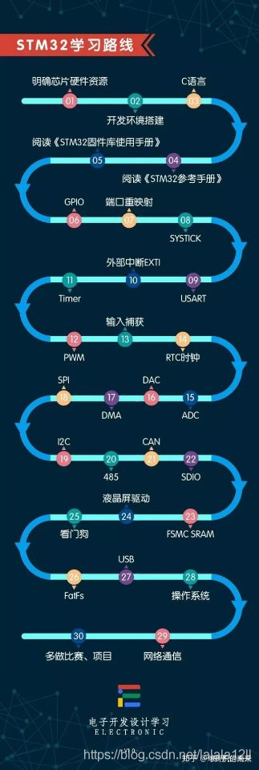
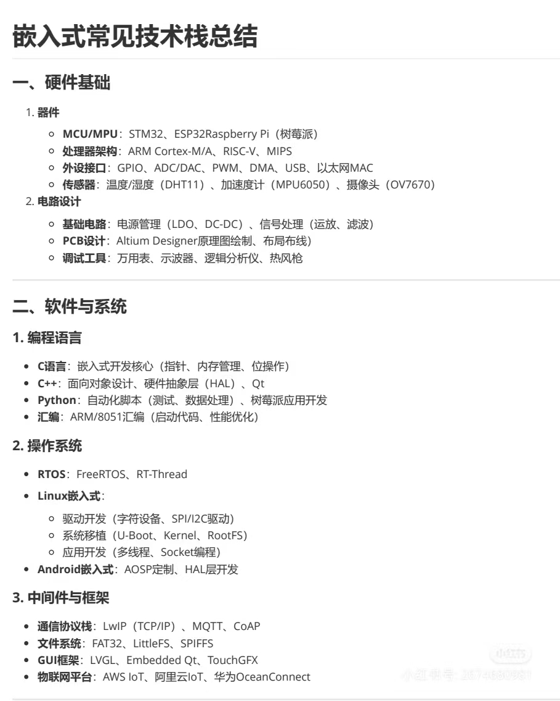
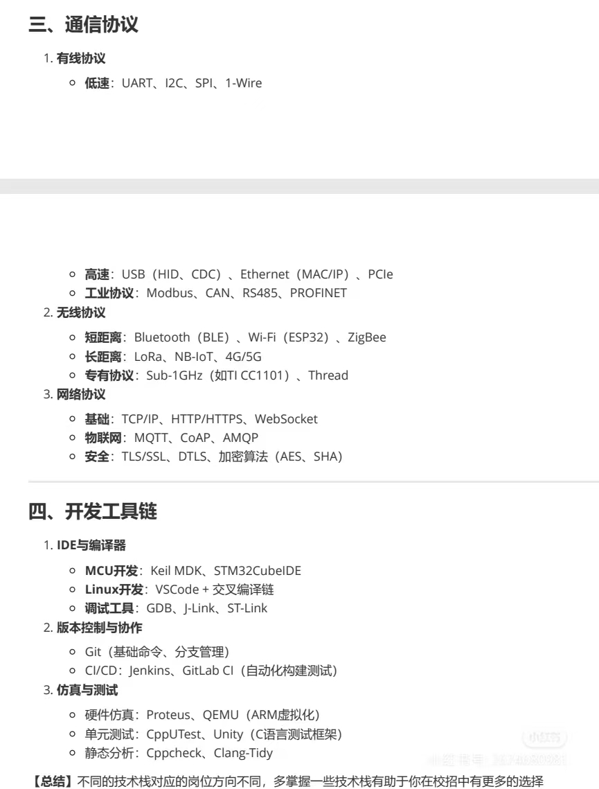

## 学习路线

https://www.bilibili.com/read/cv32914756/

https://www.robook.org/docs/handbook/embedded/qianrushiluxian

https://zhuanlan.zhihu.com/p/531416610

[意法半导体 UINIO-MCU-STM32F103 标准库典型实例](http://uinio.com/Embedded/STM32F103/#crc-%E5%BE%AA%E7%8E%AF%E5%86%97%E4%BD%99%E6%A0%A1%E9%AA%8C)

[SPI教程](https://mp.weixin.qq.com/s/uzhbNJ2ya_YzXr9CctSZYg)

## 元器件相关

在线模拟：tinkercad

[必备元器件知识1——电阻_坏坏太兲眞的博客-CSDN博客](https://blog.csdn.net/weixin_47783699/article/details/128092840?spm=1001.2014.3001.5502)

## 入门

stm32入坑指南：https://www.guyuehome.com/36087

学习路线：

## 嵌入式技术栈

## 串口学习

[STM32F103标准库开发-Uart串口通信实验-初始化配置 (stmicroelectronics.cn)](https://shequ.stmicroelectronics.cn/thread-636701-1-1.html)

## MDK及PACK包镜像下载

https://blog.csdn.net/Simon223/article/details/105090189