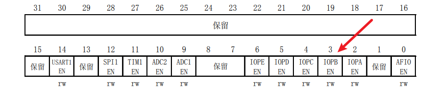
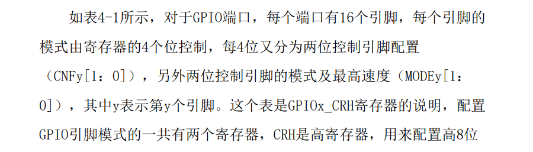
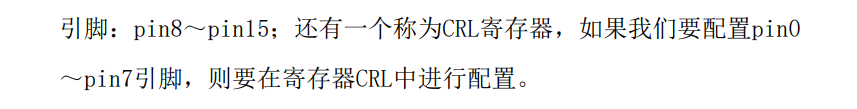
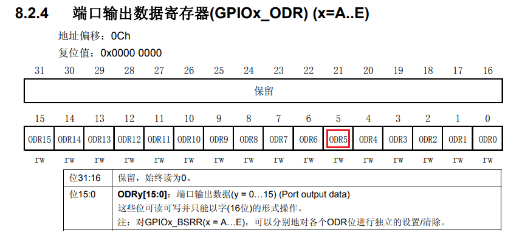

## 寄存器点灯

使能时钟



使能GPIO








```c
#include "stm32f10x.h"
#include "Delay.h"
int main(void)
{
	//时钟使能
	RCC->APB2ENR |= RCC_APB2ENR_IOPBEN;
	// 配置PB5为推挽输出，最大速度为50MHz
	GPIOB->CRL &= ~(0xF<<(5*4));// 清除PB5的配置，如果不先清除原有配置，可能会导致不期望的行为。例如，如果PB5之前被配置为输入模式，直接设置为输出模式可能会引起冲突。
	GPIOB->CRL |= (0x3<<(5*4));// 设置为推挽输出，最大速度50MHz
	GPIOB->ODR &= ~(1<<5);// 将PB5设置为低电平 1101 1111
    while (1)
    {
        Delay_ms(1000);// 延时一段时间
		GPIOB->ODR ^= (1 << 5); // 切换PB5的状态，异或计算0010 0000 相同为0，不同为一。
    }
}
```


## 流水灯

让四个LED，轮流点亮

硬件资源：

- PE1
- PE2
- PE3
- PE4

### 最简单

```c
while(1)
    {
 
        GPIO_SetBits(GPIOE,GPIO_Pin_1);
        Delay_ms(200);
        GPIO_ResetBits(GPIOE,GPIO_Pin_1);
        Delay_ms(200);
        
        GPIO_SetBits(GPIOE,GPIO_Pin_2);
        Delay_ms(200);
        GPIO_ResetBits(GPIOE,GPIO_Pin_2);
        Delay_ms(200);

        GPIO_SetBits(GPIOE,GPIO_Pin_3);
        Delay_ms(200);
        GPIO_ResetBits(GPIOE,GPIO_Pin_3);
        Delay_ms(200);

        GPIO_SetBits(GPIOE,GPIO_Pin_4);
        Delay_ms(200);
        GPIO_ResetBits(GPIOE,GPIO_Pin_4);
        Delay_ms(200);
    }
```

### 优化版

```c
int main(void)
{
    LED_Init();
    uint16_t led_list[] = {GPIO_Pin_1,GPIO_Pin_2,GPIO_Pin_3,GPIO_Pin_4};
    while(1)
    {
        uint8_t i = 0;
        for(i=0;i<4;i++)
        {
            GPIO_SetBits(GPIOE,led_list[i]);
            Delay_ms(200);
            GPIO_ResetBits(GPIOE,led_list[i]);
            Delay_ms(200);
        }
    }
}
```

### 再优化

```c
int main(void)
{
    LED_Init();
    uint16_t led_list[] = {GPIO_Pin_1,GPIO_Pin_2,GPIO_Pin_3,GPIO_Pin_4};
    GPIO_TypeDef *gpio_ports[] = {GPIOE, GPIOA, GPIOB, GPIOC}; // 添加需要的GPIO端口
    uint8_t num_leds = sizeof(led_list) / sizeof(led_list[0]);
    while(1)
    {
        uint8_t i = 0;
        for(i=0;i<num_leds;i++)
        {
            GPIO_SetBits(gpio_ports[0],led_list[i]);
            Delay_ms(200);
            GPIO_ResetBits(gpio_ports[0],led_list[i]);
            Delay_ms(200);
        }
    }
}

```

