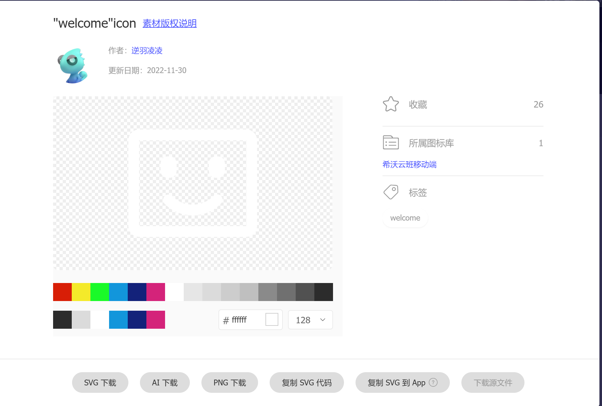
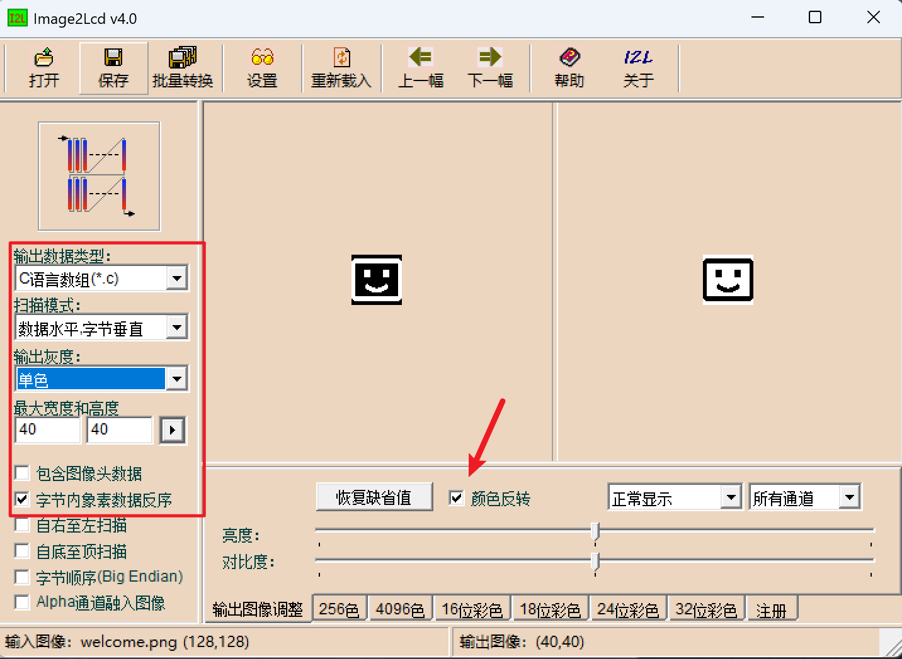

# 字取模教程

## 使用PCtoLCD2002软件

使用字符模式

使用下面的配置进行生成

## 参考教程

https://www.iotword.com/14494.html

https://blog.csdn.net/2301_81040840/article/details/147933777

# Image2Lcd取模图标方法

## 图标的选取

将图标的线条颜色设置为纯白色，然后下载png到电脑上面，接着用取模软件打开。

## 软件的设置

