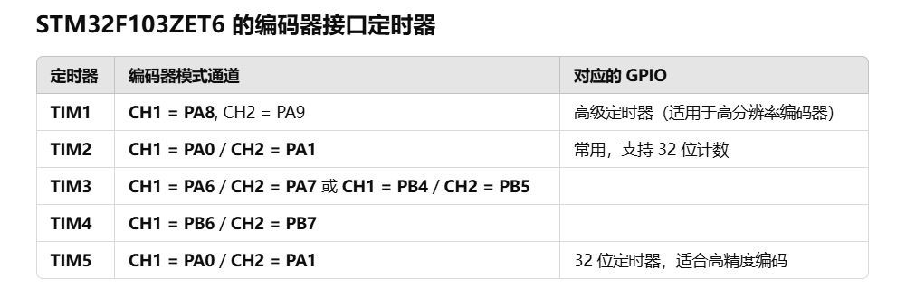

# Stm32教程

## 时钟系统

### APB

- **APB1**：低速总线，挂载基础外设（如通用定时器、UART2/3、I2C）。
- **APB2**：高速总线，挂载高性能外设（如高级定时器、ADC、GPIO）。

STM32F103的总线架构分为**APB1（低速外设总线）\**和\**APB2（高速外设总线）**：

- **时钟频率**：
  - APB2最高支持 **72 MHz**（与CPU主频一致）。
  - APB1最高支持 **36 MHz**（APB2的一半）。
- **外设类型**：
  - **APB2**：挂载对性能要求高或需要高速操作的外设，如GPIO、ADC、SPI1、高级定时器（TIM1）、USART1等。
  - **APB1**：挂载低速或功能较简单的外设，如USART2/3、UART4/5、I2C、基本定时器（TIM2-TIM7）等。

## GPIO

首先使能GPIOB的时钟

```c
// 使能GPIOB的时钟
 RCC_APB2PeriphClockCmd(RCC_APB2Periph_GPIOB, ENABLE);
```

然后配置GPIOB Pin 5

```c
void LED_GPIO_Config(void){
	GPIO_InitTypeDef GPIO_InitStructure;
	GPIO_InitStructure.GPIO_Mode = GPIO_Mode_Out_PP;
	GPIO_InitStructure.GPIO_Pin = GPIO_Pin_5;
	GPIO_InitStructure.GPIO_Speed = GPIO_Speed_50MHz;
	GPIO_Init(GPIOB,&GPIO_InitStructure);
	GPIO_SetBits(GPIOB,GPIO_Pin_5);
}
```

最后设置Pin5为低电平即可点亮

```c
GPIO_ResetBits(GPIOB, GPIO_Pin_5);  // 设置GPIOB Pin 5为低电平
```

完整代码如下：

```c
#include "stm32f10x.h"
#include "Delay.h"
void LED_GPIO_Config(void){
	GPIO_InitTypeDef GPIO_InitStructure;
	GPIO_InitStructure.GPIO_Mode = GPIO_Mode_Out_PP;
	GPIO_InitStructure.GPIO_Pin = GPIO_Pin_5;
	GPIO_InitStructure.GPIO_Speed = GPIO_Speed_50MHz;
	GPIO_Init(GPIOB,&GPIO_InitStructure);
	GPIO_SetBits(GPIOB,GPIO_Pin_5);
}
int main(void)
{
	RCC_APB2PeriphClockCmd(RCC_APB2Periph_GPIOB,ENABLE);
	LED_GPIO_Config();
	while(1){
		Delay_ms(1000);
		GPIO_ResetBits(GPIOB,GPIO_Pin_5);
		Delay_ms(1000);
		GPIO_SetBits(GPIOB,GPIO_Pin_5);
	}
}
```

GPIO输出翻转

```c
GPIOB->ODR ^= GPIO_Pin_5;
```

固件库

```
GPIO_WriteBit(GPIOB,GPIO_Pin_5,(BitAction)(1- GPIO_ReadOutputDataBit(GPIOB, GPIO_Pin_5)));
```

### 输出模式

当某个 GPIO 需要输出 **外设信号（如 PWM、USART、SPI 等）** 时，需要配置为 **复用（AF, Alternate Function）模式**，否则外设无法控制该引脚。

### 复用开漏重映射的概念

| 概念     | 说明                         | 使用场景                    | 与其他概念的关系                 |
| -------- | ---------------------------- | --------------------------- | -------------------------------- |
| GPIO复用 | 把一个IO脚用作某个外设的功能 | 如串口、I2C、SPI等          | 往往与开漏/推挽模式搭配使用      |
| 开漏输出 | 输出高电平时悬空，需外部上拉 | I2C、按键矩阵、总线冲突保护 | 可以是普通GPIO，也可以是复用功能 |
| 重映射   | 改变外设功能所在引脚         | 改变引脚布局                | 作用于复用功能引脚               |

## AFIO

**AFIO（Alternate Function I/O）是 STM32 用来配置引脚功能复用的模块。**

AFIO，全称 **Alternate Function I/O**，是 STM32F1 系列中特有的一个外设控制模块，用来：

### 1.控制 GPIO 的“复用功能”，例如：

- 某个 GPIO 脚除了做普通输入/输出，还可以：
  - 作为串口 TX/RX
  - I2C、SPI 通信引脚
  - 外部中断（EXTI）
  - TIM 输入/输出（PWM）

### 2.配置 GPIO 与 EXTI 中断线的映射关系：

STM32F1 的每一组 GPIO（如 PA4、PB4、PE4）**都可以接到 EXTI_Line4**，但：

> **同一时刻只能有一个 GPIO 映射到一个 EXTI Line**

这时候，**AFIO** 就负责告诉芯片：

> “我要把 PE4 映射到 EXTI4”

这就是你调用的函数：

```c
GPIO_EXTILineConfig(GPIO_PortSourceGPIOE, GPIO_PinSource4);
```

这个函数内部其实就是通过 AFIO 的寄存器（`AFIO->EXTICR[x]`）来配置映射关系。

## KEY

### 电路图


### 思路

首先是按键初始化，然后是按键扫描函数

### 代码

Key.h文件

```c
#ifndef __KEY_H
#define __KEY_H

void KEY_Init(void);
uint8_t KEY_Scan(void);

#define KEY0 GPIO_ReadInputDataBit(GPIOE,GPIO_Pin_4)
#define KEY0_PRES 1

#endif
```

Key.c文件

```c
#include "stm32f10x.h"                  // Device header
#include "Key.h"
#include "Delay.h"
void KEY_Init(void)
{
	RCC_APB2PeriphClockCmd(RCC_APB2Periph_GPIOE,ENABLE);
	GPIO_InitTypeDef GPIO_InitStructure;
	GPIO_InitStructure.GPIO_Mode = GPIO_Mode_IPU;
	GPIO_InitStructure.GPIO_Pin = GPIO_Pin_4|GPIO_Pin_3; //KEY0,KEY1
	GPIO_InitStructure.GPIO_Speed = GPIO_Speed_50MHz;
	GPIO_Init(GPIOE,&GPIO_InitStructure);
}

uint8_t KEY_Scan(void)
{
	if(KEY0==0){
		Delay_ms(20);
		while(KEY0==0);
		Delay_ms(20);
		return KEY0_PRES;
	}
	return 0;
}
```

main.c文件

```c
#include "stm32f10x.h"
#include "LED.h"
#include "Delay.h"
#include "Key.h"


int main(void)
{
	uint8_t key = 0;
	LED_Init();
	KEY_Init();
	while(1) {
		key = KEY_Scan();
		if(key){
			switch(key)
			{
				case KEY0_PRES:
				GPIO_WriteBit(GPIOB,GPIO_Pin_5,(BitAction)(1- GPIO_ReadOutputDataBit(GPIOB, GPIO_Pin_5)));
				break;
			}
		}
	}
}
```

### 配置中断触发的方法

1. 修改 GPIO 配置为浮空输入（或上拉输入）

2. 开启 AFIO（复用功能时钟）

3. 配置 EXTI 线路和触发方式（配置中断来源）

4. 配置 NVIC 中断控制器

5. 编写中断服务函数（ISR，在中断向量表里面查找）

6. 中断向量表的位置

   

### 软件去抖动

```c
void EXTI4_IRQHandler(void)
{
	if (EXTI_GetITStatus(EXTI_Line4) != RESET)
	{
		Delay_ms(20);																			 // 消抖：等待电平稳定
		if (GPIO_ReadInputDataBit(GPIOE, GPIO_Pin_4) == 0) // 再次判断是否真的是按键按下
		{
			LED_Toggle(); // 真正执行操作
		}
		// 清除中断标志位
		EXTI_ClearITPendingBit(EXTI_Line4);
	}
}
```

## EXTI

参考教程：https://blog.csdn.net/weixin_56459724/article/details/141903464

### EXTI通道

芯片内部有一个EXTI控制器,控制器上有23个EXTI接口--->23个中断源（16+7）


### 注意点：

1. 配置外部中断的GPIO引脚源需要开启AFIO时钟

## NVIC

嵌套向量中断控制器

### **关键概念**

1. **NVIC (Nested Vectored Interrupt Controller)**
   ARM Cortex-M 处理器中管理中断的模块，负责中断优先级、使能/禁用中断等。
2. **抢占优先级（Preemption Priority）**：决定哪个中断能打断正在执行的中断，值越小，优先级越高。
3. 子优先级（Sub Priority）：当多个相同抢占优先级的中断发生时，决定谁先执行，值越小，优先级越高。
4. 数字越小，优先级越高。

代码：

```c
void NVIC_Config(void) {
    NVIC_InitTypeDef NVIC_InitStructure;
    
    // 设置中断优先级
    NVIC_InitStructure.NVIC_IRQChannel = TIM3_IRQn;
    NVIC_InitStructure.NVIC_IRQChannelPreemptionPriority = 0;
    NVIC_InitStructure.NVIC_IRQChannelSubPriority = 0;
    NVIC_InitStructure.NVIC_IRQChannelCmd = ENABLE;
    
    // 配置NVIC
    NVIC_Init(&NVIC_InitStructure);
}
```

### 中断优先级分组

STM32F10x **支持 4 组优先级划分模式**（由 `NVIC_PriorityGroupConfig()` 设定），分配方式如下：

中断优先级分组表：

| 优先级分组           | 抢占优先级 | 子优先级   | **适用场景**                   |
| -------------------- | ---------- | ---------- | ------------------------------ |
| NVIC_PriorityGroup_0 | 取值：0    | 取值：0~15 | 只区分子优先级，适用于简单系统 |
| NVIC_PriorityGroup_1 | 取值：0~1  | 取值：0~7  | 适用于少量高优先级任务         |
| NVIC_PriorityGroup_2 | 取值：0~3  | 取值：0~3  | **推荐，适用于大部分应用**     |
| NVIC_PriorityGroup_3 | 取值：0~7  | 取值：0~1  | 适用于高实时性任务             |
| NVIC_PriorityGroup_4 | 取值：0~15 | 取值：0    | 仅抢占优先级，适用于实时控制   |

使用示例

```c
NVIC_PriorityGroupConfig(NVIC_PriorityGroup_2);
```

设定 **抢占优先级 2 位，子优先级 2 位**。

这样，每个中断都有：

- **4 级抢占优先级（0~3）**。
- **4 级子优先级（0~3）**。

**示例：**

```c
NVIC_InitTypeDef NVIC_InitStructure;
NVIC_InitStructure.NVIC_IRQChannel = EXTI0_IRQn;
NVIC_InitStructure.NVIC_IRQChannelPreemptionPriority = 1;  // 抢占优先级 1
NVIC_InitStructure.NVIC_IRQChannelSubPriority = 1;         // 子优先级 1
NVIC_Init(&NVIC_InitStructure);

NVIC_InitStructure.NVIC_IRQChannel = EXTI1_IRQn;
NVIC_InitStructure.NVIC_IRQChannelPreemptionPriority = 1;  // 抢占优先级 1
NVIC_InitStructure.NVIC_IRQChannelSubPriority = 2;         // 子优先级 2
NVIC_Init(&NVIC_InitStructure);
```

- `EXTI0_IRQn` 和 `EXTI1_IRQn` **抢占优先级相同（1）**，不会互相打断。
- `EXTI0_IRQn` 的 **子优先级更高（1）**，当 `EXTI0_IRQn` 和 `EXTI1_IRQn` **同时触发** 时，**EXTI0_IRQn 先执行**。

### 注意点

1. 中断服务函数，一般不需要写在h文件当中
2. 当有多个中断事件，需要配置中断优先级分组

## TIMER

### 定时时间的计算

**预分频器 (Prescaler)：**预分频器用于降低定时器输入的时钟频率，使得计数器以较低的速率工作。

**自动重装载寄存器 (ARR, Auto Reload Register)：**ARR 决定了定时器计数器的最大计数值，从 0 开始计数，当计数器计数到 ARR 的值后，会自动重置为 0，并重新开始计数。

假设定时器的输入时钟频率为 72MHz，那么要实现 2 秒定时，需要满足下面的公式：


先分频，得到分频后，实际计数时用的时钟频率

72000000/7200 = 1000000次/秒

这相当于说每个“滴答”发生一次的时间为


然后再用这个滴答时间去乘自动重装载寄存器的值就是总的定时器的时间了。

### 为什么PSC和ARR都要+1

假设我们有一个计数器，每次时钟跳变时计数器增加 1。如果我们从 0 开始计数，到达 3 时，计数器的状态变化如下：

- **状态**：0 → 1 → 2 → 3
- **计数次数**：一共经历了 4 个状态，因为 0 也是一个有效的状态。

这里虽然 0 到 3 之间看起来只有 3 个“间隔”（从 0 到 1，1 到 2，2 到 3），但计时器记录的是每个状态的存在，而不是仅仅计量间隔。

**间隔的概念**：如果你只考虑数值之间的差异，从 0 到 3 之间确实有 3 个间隔。

**状态的概念**：但是当计时器工作时，每个状态都对应一个时钟周期。所以计时器会运行 4 个时钟周期。

### 为什么配了中断还得配置NVIC

STM32 的中断系统有两个层级控制，**缺一不可**：

STM32 中断 = 外设触发 + NVIC允许

### 定时器的区别


### 中断服务函数

`TIM2_IRQHandler()` 是一个“中断服务函数”，它由启动文件（startup 文件）声明并调用，不需要用户手动在 `.h` 中声明。

为什么 main.c 或 timer.c 都能放这个函数，并且能正常工作。
只要你写的是**void TIM2_IRQHandler(void)** 且函数名完全匹配，编译器就能识别，链接器就能把这个函数地址**“绑定”**到向量表中。

### 编码器接口

- 编码器接口可接收增量（正交）编码器的信号，根据编码器旋转产生的正交信号脉冲，自动控制CNT自增或自减，从而指示编码器的位置、旋转方向和旋转速度。
- 每个高级定时器和通用定时器都拥有1个编码器接口
- 两个输入引脚借用了输入捕获的通道1和通道2

原理：


基本结构：


编码器接口抗噪声


## PWM

### PWM分辨率

PWM的**分辨率**（Resolution）指的是PWM信号能够表示的最小变化单位，通常以**位数（bits）**表示。例如，8位（8-bit）PWM的分辨率是 2⁸ = 256，即占空比可以有 0~255 共 256 个不同的离散值。

分辨率的高低决定了PWM信号的**精细程度**，即在给定的PWM周期内，占空比能被划分为多少个离散的等级。分辨率由PWM计数器的位数决定：

- 8位PWM：分辨率为 1/256（0.39%）
- 10位PWM：分辨率为 1/1024（0.098%）
- 12位PWM：分辨率为 1/4096（0.024%）

### PWM占空比

**占空比**（Duty Cycle）指的是PWM信号的高电平时间与整个周期的比值，用百分比表示

占空比 50%：高电平时间占一半

占空比 25%：高电平时间占四分之一

占空比 75%：高电平时间占四分之三

### 分辨率和ARR的关系

假设代码中的PSC为719，ARR是999，那么

**周期（ARR）** = 999

**预分频（PSC）** = 719

STM32F103ZET6 的**定时器时钟**：默认 APB1 计时器时钟 = 72 MHz（假设使用 APB1 低速定时器，如 TIM2、TIM3、TIM4）

STM32 的定时器一般是 **16位计数**（最大值 65535）


### 分辨率越高的影响

✅ **高分辨率的 PWM 可以让 LED 亮度调节更细腻，尤其在低亮度区域，避免亮度跳变和闪烁，使渐变更加平滑。**
✅ **如果做 LED 调光，推荐使用 10-bit 或更高分辨率的 PWM，尤其适用于显示屏背光、氛围灯等需要精细控制的场景。**
✅ **同时要配合适当的 PWM 频率（建议 > 1kHz）以避免人眼可见的闪烁现象。**


### PWM配置步骤

1.开启TIM3时钟、GPIOB时钟和复用功能时钟
2.配置GPIOB5为复用输出
3.设置TIM3_CH2重映射到PB5上
4.初始化TIM3,设置ARR和PSC
5.设置TIM3_CH2的PWM模式
6.使能TIM3的CH2输出
7.使能TIM3
8.在主函数中改变占空比完成呼吸灯

## TB6612驱动直流电机

### 接线图

根据实际情况做一定的修改


### 思路

使用PA6作为PWM输出引脚，查看设备手册，知道使用TIM3的CH1通道进行PWM配置


PWM.c

```c
#include "stm32f10x.h"                  // Device header

void PWM_Init(void)
{
    //使能定时器3时钟
    RCC_APB1PeriphClockCmd(RCC_APB1Periph_TIM3, ENABLE);
    
    //初始化GPIO并开启复用功能
    RCC_APB2PeriphClockCmd(RCC_APB2Periph_GPIOA|RCC_APB2Periph_AFIO,ENABLE);

    GPIO_InitTypeDef GPIO_InitStructure;
    GPIO_InitStructure.GPIO_Mode = GPIO_Mode_AF_PP;
    GPIO_InitStructure.GPIO_Pin = GPIO_Pin_6;
    GPIO_InitStructure.GPIO_Speed = GPIO_Speed_50MHz;
    GPIO_Init(GPIOA, &GPIO_InitStructure);
    
    
    //配置定时器
    TIM_InternalClockConfig(TIM3); //可以不写
    
    TIM_TimeBaseInitTypeDef TIM_TimeBaseInitStructure;
    
    TIM_TimeBaseInitStructure.TIM_ClockDivision = TIM_CKD_DIV1;
    TIM_TimeBaseInitStructure.TIM_CounterMode = TIM_CounterMode_Up;
    TIM_TimeBaseInitStructure.TIM_Period = 100 -1; //0-65535 ARR
    TIM_TimeBaseInitStructure.TIM_Prescaler = 720 - 1; //0-65535 PSC
    TIM_TimeBaseInitStructure.TIM_RepetitionCounter = 0;
    TIM_TimeBaseInit(TIM3,&TIM_TimeBaseInitStructure);
    
    TIM_OCInitTypeDef TIM_OCInitStructure;
    TIM_OCStructInit(&TIM_OCInitStructure);//赋初始值
    TIM_OCInitStructure.TIM_OCMode = TIM_OCMode_PWM1;//设置输出比较模式 PWM模式1
    TIM_OCInitStructure.TIM_OCPolarity = TIM_OCPolarity_High;//设置输出比较极性
    TIM_OCInitStructure.TIM_OutputState = TIM_OutputState_Enable;//设置输出比较使能
    TIM_OCInitStructure.TIM_Pulse = 0;//设置CCR
    
    //初始化输出比较通道
    TIM_OC1Init(TIM3,&TIM_OCInitStructure);
    //使能TIM3在CCR1上的预装载寄存器
    TIM_OC1PreloadConfig(TIM3, TIM_OCPreload_Enable);  
    //使能TIM3
    TIM_Cmd(TIM3,ENABLE);
}


void PWM_setCompare1(uint16_t compare)
{
  TIM_SetCompare1(TIM3,compare);
}

```

Motor.c

```c
#include "stm32f10x.h"                  // Device header
#include "PWM.h"

void Motor_Init(void)
{
    RCC_APB2PeriphClockCmd(RCC_APB2Periph_GPIOA, ENABLE);
    GPIO_InitTypeDef GPIO_InitStructure;
    GPIO_InitStructure.GPIO_Mode = GPIO_Mode_Out_PP;
    GPIO_InitStructure.GPIO_Pin = GPIO_Pin_4|GPIO_Pin_5;
    GPIO_InitStructure.GPIO_Speed = GPIO_Speed_50MHz;
    GPIO_Init(GPIOA, &GPIO_InitStructure);
    
    PWM_Init();
}

// speed的正负决定旋转的方向
void Motor_Setspeed(int8_t speed)
{
    if(speed >= 0)
    {
        // 设置电机旋转方向
        GPIO_SetBits(GPIOA,GPIO_Pin_5);
        GPIO_ResetBits(GPIOA,GPIO_Pin_4);
        PWM_setCompare1(speed);
    }
    else
    {
        GPIO_SetBits(GPIOA,GPIO_Pin_4);
        GPIO_ResetBits(GPIOA,GPIO_Pin_5);
        PWM_setCompare1(-speed);
    }
}
```


## USART

### 通信接口


### 电平标准


差分信号的抗干扰能力较强，传输距离可达上千米

### 串口参数


### 奇偶校验

奇校验：就是确保数据位+校验位中，1的个数为奇数，0的位数为偶数，数据位中有4个1的话，校验位就要补一个1，变成奇数次，然后接收方再去判断数据位+校验位的1的个数是不是奇数次。不是的话就说明出错了。

### 基本结构


### USART和UART的区别

**USART (Universal Synchronous/Asynchronous Receiver/Transmitter)**：通用同步异步收发器

**UART (Universal Asynchronous Receiver/Transmitter)**：通用异步收发器

硬件资源差异：


### 项目实战

查看原理图


通过查看手册的值，串口1需要使用PA9和PA10进行配置

USART1挂在APB2下
USART2,USART3,USART4,USART5挂在APB1下

PA9配置为复用推挽输出

PA10配置为浮空输入

### USART配置步骤

1. 启用GPIO和USART1的时钟
2. 设置 TX 引脚为复用推挽输出模式，RX 引脚为浮空输入或上拉输入设置 TX 引脚为复用推挽输出模式，RX 引脚为浮空输入或上拉输入
3. 设置波特率、数据位、停止位、校验位等参数，使能 USART 发送和接收功能。
4. 使能 USART1 中断
5. 设置 USART1 中断优先级并使能 NVIC 对应中断
6. 在 ISR 里处理接收数据（如存入缓冲区）
7. 编写发送字符的函数

### fputc重定向

简介：重定向 `fputc` 函数，使得 `printf` 能够通过串口输出数据

原理：Keil 的 **MicroLIB** 是专为嵌入式系统优化的轻量级 C 库，它简化了标准库的依赖关系，并支持通过重定向 `fputc` 和 `fgetc` 实现 I/O 功能，启用 MicroLIB 后，`printf` 不再依赖复杂的系统调用，而是直接调用用户定义的 `fputc`。

教程：

首先启用 **MicroLIB**（简化 C 库，适合嵌入式系统）：

1. 右键点击 Target → Options for Target → Target 标签页
2. 勾选 "Use MicroLIB"


**USART.c** 文件中添加下面的这个代码

```c
#include <stdio.h>

// 必须包含 stdio.h 才能重定向 printf

// 重定向 fputc 到串口1 (USART1)
int fputc(int ch, FILE *f)
{
    // 等待发送寄存器空
    while (USART_GetFlagStatus(USART1, USART_FLAG_TXE) == RESET);
    
    // 发送字符
    USART_SendData(USART1, (uint8_t)ch);
    
    return ch;
}
```

在 **main函数中** 初始化USART并测试printf

```c
int main(void)
{
    // 初始化 USART1
    USART1_Init();

    // 测试 printf
    printf("STM32F103 USART1 printf test!\r\n");
    printf("Value: %d, Hex: 0x%x\r\n", 1234, 1234);

    while (1)
    {
        // 主循环
    }
}
```

### Hex数据包接收


利用状态机的思想

### 文本数据包接收


## 旋转编码计数器

参考教程：

**https://mp.weixin.qq.com/s/uFlAz8YNoOzXvJw4H6SWPA**

**https://blog.csdn.net/qq_63434393/article/details/132489786**

### 实现逻辑

初始化GPIO，并开启EXTI外部中断

配置中断

配置NVIC

编写中断服务函数

PB0-A

PB1-B

**Encoder.c**

```c

#include "stm32f10x.h"                  // Device header
 
int16_t EncoderCount;
 
void Encoder_Init(void)
{
    RCC_APB2PeriphClockCmd(RCC_APB2Periph_GPIOB,ENABLE);
    RCC_APB2PeriphClockCmd(RCC_APB2Periph_AFIO,ENABLE);
    
    GPIO_InitTypeDef GPIO_InitStructure;
    GPIO_InitStructure.GPIO_Mode = GPIO_Mode_IPU;
    GPIO_InitStructure.GPIO_Pin = GPIO_Pin_0 | GPIO_Pin_1;
    GPIO_InitStructure.GPIO_Speed = GPIO_Speed_50MHz;
    GPIO_Init(GPIOB,&GPIO_InitStructure);
 
    GPIO_EXTILineConfig(GPIO_PortSourceGPIOB, GPIO_PinSource0);
    GPIO_EXTILineConfig(GPIO_PortSourceGPIOB, GPIO_PinSource1);
 
    EXTI_InitTypeDef EXTI_InitStructure;
    EXTI_InitStructure.EXTI_Line = EXTI_Line0 | EXTI_Line1;
    EXTI_InitStructure.EXTI_LineCmd = ENABLE;
    EXTI_InitStructure.EXTI_Mode = EXTI_Mode_Interrupt;
    EXTI_InitStructure.EXTI_Trigger = EXTI_Trigger_Rising;
    EXTI_Init(&EXTI_InitStructure);
 
    NVIC_PriorityGroupConfig(NVIC_PriorityGroup_2);
 
    NVIC_InitTypeDef NVIC_InitStructure;
    NVIC_InitStructure.NVIC_IRQChannel = EXTI0_IRQn;
    NVIC_InitStructure.NVIC_IRQChannelCmd = ENABLE;
    NVIC_InitStructure.NVIC_IRQChannelPreemptionPriority = 1;
    NVIC_InitStructure.NVIC_IRQChannelSubPriority = 1;
    NVIC_Init(&NVIC_InitStructure);
    
    NVIC_InitStructure.NVIC_IRQChannel = EXTI1_IRQn;
    NVIC_InitStructure.NVIC_IRQChannelCmd = ENABLE;
    NVIC_InitStructure.NVIC_IRQChannelPreemptionPriority = 1;
    NVIC_InitStructure.NVIC_IRQChannelSubPriority = 2;
    NVIC_Init(&NVIC_InitStructure);
 
}
 
 
 
void EXTI0_IRQHandler(void)
{
    if (EXTI_GetITStatus(EXTI_Line0) == SET)
    {
      if (GPIO_ReadInputDataBit(GPIOB,GPIO_Pin_1) == 0)
      {
        EncoderCount--;
      }
        EXTI_ClearITPendingBit(EXTI_Line0);
    }
}
 
void EXTI1_IRQHandler(void)
{
    if (EXTI_GetITStatus(EXTI_Line1) == SET)
    {
      if (GPIO_ReadInputDataBit(GPIOB,GPIO_Pin_0) == 0)
      {
        EncoderCount++;
      }
        EXTI_ClearITPendingBit(EXTI_Line1);
    }
}
 
int16_t Encoder_Get(void)
{
  int16_t temp;
  temp = EncoderCount;
  EncoderCount = 0;
  return temp;
}
```

**Encoder.h**

```c
#ifndef __ENCODER_H
#define __ENCODER_H

void Encoder_Init(void);
int16_t Encoder_Get(void);
#endif
```

## 编码器接口测速

引脚：



基本结构：


原理：在一定的时间间隔内输出计数的个数

误区：一开始我使用的是TIM3的CH3和CH4,发现配置好之后不能正常工作，查资料才发现，编码器是有特定的通道的，需要查手册得知。

下面是具体的代码

**main.c**

```c
#include "stm32f10x.h"
#include "stdio.h"
#include "LED.h"
#include "Delay.h"
#include "Key.h"
#include "PWM.h"
#include "Motor.h"
#include "USART.h"
#include "Encoder.h"
#include "OLED.h"

int main(void)
{
    Encoder_Init();
    int speed = 40;
	OLED_Init();

    while(1)
    {
		OLED_ShowString(16, 18, "speed:", OLED_8X16);
		OLED_ShowSignedNum(68,18,Encoder_Get(),3,OLED_8X16);
		OLED_Update();
        Delay_ms(1000); //闸门时间是1s
    }
}
```

**Encoder.c**

```c

#include "stm32f10x.h"                  // Device header

void Encoder_Init(void)
{
    // 使能 GPIOA 和 TIM5 时钟
    RCC_APB2PeriphClockCmd(RCC_APB2Periph_GPIOA, ENABLE);
    RCC_APB1PeriphClockCmd(RCC_APB1Periph_TIM5, ENABLE);
    
    // 配置 GPIOA PB0/PB1 为浮空输入（或根据电路选择上拉）
    GPIO_InitTypeDef GPIO_InitStructure;
    GPIO_InitStructure.GPIO_Pin = GPIO_Pin_0 | GPIO_Pin_1;
    GPIO_InitStructure.GPIO_Mode = GPIO_Mode_IN_FLOATING; // 或 GPIO_Mode_IPU
    GPIO_InitStructure.GPIO_Speed = GPIO_Speed_50MHz;
    GPIO_Init(GPIOA, &GPIO_InitStructure);

    // 配置 TIM5 为编码器模式
    TIM_TimeBaseInitTypeDef TIM_TimeBaseInitStructure;
    TIM_TimeBaseInitStructure.TIM_Period = 0xFFFF; // 16位计数器最大值
    TIM_TimeBaseInitStructure.TIM_Prescaler = 0;   // 无分频，直接计数
    TIM_TimeBaseInitStructure.TIM_ClockDivision = TIM_CKD_DIV1;
    TIM_TimeBaseInitStructure.TIM_CounterMode = TIM_CounterMode_Up;
    TIM_TimeBaseInit(TIM5, &TIM_TimeBaseInitStructure);

    // 直接配置定时器的编码器接口模式
    TIM_EncoderInterfaceConfig(TIM5, TIM_EncoderMode_TI12, TIM_ICPolarity_Rising, TIM_ICPolarity_Rising);

    // 使能 TIM5
    TIM_Cmd(TIM5, ENABLE);

    // 计数器清零
    TIM_SetCounter(TIM5, 0);
}

/// @brief 获取旋转编码器的计数值
/// @return 返回编码器的计数（可为正负）
int16_t Encoder_Get(void)
{
    /* return (int16_t)TIM_GetCounter(TIM5); */
    int16_t Temp;
    Temp = TIM_GetCounter(TIM5);
    TIM_SetCounter(TIM5,0);
    return Temp;
}
```


## ADC


### 转换模式

四种转换模式：

- 单次，连续
- 扫描，非扫描模式

进行组合

### 转换时间


### 转换公式

ADC的值/4096*3.3V

### 当设置阈值时，ADC的值来回跳变怎么办

设置两个阈值即可，一个上阈值，一个下阈值

### 多通道


三个传感器，分别接到4,5,6引脚上面

使用扫描模式，实现多通道的功能

也可以使用单次非扫描模式，通过修改通道号实现功能

## DMA

> 直接存储器存取

### DMA的基本结构


## OLED

确定引脚：


### 硬件IIC和软件IIC的区别

| 名称 | SCL引脚                | SDA引脚  |
| ---- | ---------------------- | -------- |
| I2C1 | PB6 (SCL), PB7 (SDA)   | 硬件固定 |
| I2C2 | PB10 (SCL), PB11 (SDA) | 硬件固定 |

如果你使用 **硬件 I2C**，那么：

- **必须使用这些固定的引脚**，否则无法直接使用 STM32 的 I2C 硬件外设进行通信。

为了更灵活地选择引脚，很多人会选择 **软件 I2C（Soft I2C）** 的方式。通过 GPIO 模拟 I2C 协议，只要是普通 IO 口，理论上任意两根引脚都可以模拟 I2C 来驱动 OLED。

优点：

- **引脚不受限制**，任意两个 GPIO。
- 灵活方便，适合资源紧张或布局特殊的情况。

缺点：

- 占用 CPU 资源，效率低于硬件 I2C。
- 速度较慢（一般对 SSD1306 足够用了）。

## IIC协议


### IIC协议的特点

| 特点           | 通俗解释                                           |
| -------------- | -------------------------------------------------- |
| **两根线**     | 简单省线，SCL 和 SDA。                             |
| **多设备通信** | 一条线上可以挂很多设备，像大家在一条线上聊天。     |
| **主从模式**   | **主机（比如单片机）** 发起通信，设备听命。        |
| **地址唯一**   | 每个设备有个唯一地址（像门牌号），方便喊名字找人。 |
| **速度灵活**   | 常见速度：标准模式（100kHz）、快速模式（400kHz）。 |

### 外设简介


### 外设功能框图


### 硬件I2C


###  坑一

硬件I2C加入延时退出功能下载到STM32之后，不能正常功能，需要手动断电重启stm32才能正常工作，问了ChatGPT说是MPU6050的启动需要自检还是什么东西的。

## SPI

> 串行外设接口
>
> SPI 就像一根滑轮的绳子，**拉出去一点（发），对方也会拉回来一点（收）** —— 同步通信，进退一体。

### w25q128接线

这里用的是SPI2


### 简介


### 硬件电路


### 移位示意图


### Flash操作注意事项


### 外设基本结构


## Unix&BKP&VBAT

### Unix时间戳


UTC和GMT的概念


### GMT 和 UTC 的区别（通俗对比）：

| 比较点     | GMT               | UTC                        |
| ---------- | ----------------- | -------------------------- |
| 基准       | 地球自转          | 原子钟 + 地球自转          |
| 是否精确   | 较粗略            | 很精确                     |
| 是否加闰秒 | ❌ 不加            | ✅ 有时加一秒调整           |
| 当前用途   | 已基本被 UTC 替代 | ✅ 全球标准时间（默认使用） |

> > **原子钟是目前人类最精确的“时间尺子”**，用原子的震动频率来定义秒，确保全球统一计时、通信、导航等系统高精度运行。

### VBAT引脚

正点原子精英板的VBAT引脚默认是接了VCC的


### BKP基本结构


### RTC简介


## 延时

### 基于软件延时的延时

为什么它能实现 1 秒的延时？

在 STM32F10x 系列芯片上，系统时钟通常是 72 MHz（即每秒钟 72000000 个时钟周期）。空循环指令执行的时间会非常短，所以你需要通过一个较大的计数值来“消耗”时间。通过设置 `i = 12000`，内层的循环大约会耗费 1 毫秒，外层循环控制总延时。

因此，你的 `delay_ms(1000)` 实现了大约 1 秒的延时。

```c
#include "stm32f10x.h"
void LED_GPIO_Config(void){
	GPIO_InitTypeDef GPIO_InitStructure;
	GPIO_InitStructure.GPIO_Mode = GPIO_Mode_Out_PP;
	GPIO_InitStructure.GPIO_Pin = GPIO_Pin_5;
	GPIO_InitStructure.GPIO_Speed = GPIO_Speed_50MHz;
	GPIO_Init(GPIOB,&GPIO_InitStructure);
	GPIO_SetBits(GPIOB,GPIO_Pin_5);
}
// 延时函数
void delay_ms(u16 time){
	u16 i = 0;
	while(time--){
		i = 12000;
		while(i--);
	}
}
int main(void)
{
	SystemInit();
	RCC_APB2PeriphClockCmd(RCC_APB2Periph_GPIOB,ENABLE);
	LED_GPIO_Config();
	GPIO_ResetBits(GPIOB,GPIO_Pin_5);
	while(1){
		delay_ms(1000);
		GPIO_ResetBits(GPIOB,GPIO_Pin_5);
		delay_ms(1000);
		GPIO_SetBits(GPIOB,GPIO_Pin_5);
	}
	
}
```

### 基于Systick的延时

**main.c**

```c
#include "stm32f10x.h"
void LED_Init(void){
	RCC_APB2PeriphClockCmd(RCC_APB2Periph_GPIOB,ENABLE); //使能GPIOB时钟

	GPIO_InitTypeDef GPIO_InitStructure;
	GPIO_InitStructure.GPIO_Mode = GPIO_Mode_Out_PP;
	GPIO_InitStructure.GPIO_Pin = GPIO_Pin_5;
	GPIO_InitStructure.GPIO_Speed = GPIO_Speed_50MHz;
	GPIO_Init(GPIOB,&GPIO_InitStructure);
	GPIO_SetBits(GPIOB,GPIO_Pin_5);
}
// 延时函数
volatile uint32_t TimingDelay = 0; //全局延时计数器

void SysTick_Init(void){
	SysTick_Config(SystemCoreClock / 1000); //72MHz下，1ms中断一次
	NVIC_SetPriority(SysTick_IRQn,0); // 设置中断优先级
}

void Delay_ms(uint32_t ms){
	TimingDelay = ms;
	while (TimingDelay!=0);
}

int main(void)
{
	SystemInit();
	
	LED_Init();
	SysTick_Init();
	while(1){
		Delay_ms(1000);
		GPIO_ResetBits(GPIOB,GPIO_Pin_5);
		Delay_ms(1000);
		GPIO_SetBits(GPIOB,GPIO_Pin_5);
	}
}
```

**stm32f10x_it.c**

```c
extern volatile uint32_t TimingDelay;
void SysTick_Handler(void)
{
	if(TimingDelay != 0x00){
		TimingDelay--;
	}
}
```

`volatile` 关键字的作用是确保编译器在每次使用该变量时都从内存中读取它的最新值，而不是使用缓存值。它通常用于处理可能会在中断服务程序、外部设备或硬件事件中修改的全局变量。

`extern` 关键字告诉编译器，`TimingDelay` 变量是在其他文件中定义的，而不是在当前文件中定义的。通过这样做，`stm32f10x_it.c` 可以访问 `main.c` 中的全局变量。

### 基于TIM3的延时

main.c

```c
#include "stm32f10x.h"
#include "Delay.h"

void LED_Init(void){
	RCC_APB2PeriphClockCmd(RCC_APB2Periph_GPIOB,ENABLE); //使能GPIOB时钟

	GPIO_InitTypeDef GPIO_InitStructure;
	GPIO_InitStructure.GPIO_Mode = GPIO_Mode_Out_PP;
	GPIO_InitStructure.GPIO_Pin = GPIO_Pin_5;
	GPIO_InitStructure.GPIO_Speed = GPIO_Speed_50MHz;
	GPIO_Init(GPIOB,&GPIO_InitStructure);
	GPIO_SetBits(GPIOB,GPIO_Pin_5);
}


void TIM3_Config(void)
{
	TIM_TimeBaseInitTypeDef TIM_TimeBaseInitStructure;
	//启用TIM3时钟
	RCC_APB1PeriphClockCmd(RCC_APB1Periph_TIM3,ENABLE);
	//设置定时器频率
	TIM_TimeBaseInitStructure.TIM_Period = 10000-1; // 设置自动重装载值ARR，也就是时钟周期
	TIM_TimeBaseInitStructure.TIM_Prescaler = 7200-1; // 预分频器PSC，72MHz / 7200 = 10KHz，1s钟可以数10000次，对应上面的ARR，就实现了1s定时
	TIM_TimeBaseInitStructure.TIM_ClockDivision = TIM_CKD_DIV1; //设置时钟分频
	TIM_TimeBaseInitStructure.TIM_CounterMode = TIM_CounterMode_Up; //设置定时器计数模式，表示定时器计数器是从 0 增加到 ARR 设置的值，当计数器达到 ARR 时，它会产生更新事件并重置为 0。
	// 定时器周期 = PSC*ARR/系统时钟 = 1s

	TIM_TimeBaseInit(TIM3,&TIM_TimeBaseInitStructure);
	// 启用TIM3更新中断
	TIM_ITConfig(TIM3,TIM_IT_Update,ENABLE);
	// 启用TIM3计数器
	TIM_Cmd(TIM3,ENABLE);
}

void NVIC_Config(void){
	NVIC_InitTypeDef NVIC_InitStructure;
	
	// 设置中断优先级
	NVIC_InitStructure.NVIC_IRQChannel = TIM3_IRQn; // 配置中断通道
	NVIC_InitStructure.NVIC_IRQChannelPreemptionPriority = 0; // 抢占优先级，此中断可以打断所有抢占优先级 > 0 的中断。
	NVIC_InitStructure.NVIC_IRQChannelSubPriority = 0; // 子优先级，在同一抢占优先级的中断中，TIM3 中断将优先响应。
	NVIC_InitStructure.NVIC_IRQChannelCmd = ENABLE;

	// 应用 NVIC 配置
	NVIC_Init(&NVIC_InitStructure);
}

int main(void)
{
	
	LED_Init();
	TIM3_Config();
	NVIC_Config();

	// while(1){
	// 	Delay_ms(1000);
	// 	GPIO_ResetBits(GPIOB,GPIO_Pin_5);
	// 	Delay_ms(1000);
	// 	GPIO_SetBits(GPIOB,GPIO_Pin_5);
	// }
	// 无限循环，等待中断触发
	while(1) {
	}
}
```

stm32f10x_it.h


```
void TIM3_IRQHandler(void); //TIM3中断
```

stm32f10x_it.c


```c
void TIM3_IRQHandler(void)
{
  if(TIM_GetITStatus(TIM3,TIM_IT_Update)!=RESET){
    // 清除中断标志
    TIM_ClearITPendingBit(TIM3,TIM_IT_Update);

    // 切换PB5的状态
    GPIOB->ODR ^= GPIO_Pin_5;
  }
}
```

## 基于 SysTick 的延时原理

### 1. SysTick 定时器简介

STM32 内核自带一个 **SysTick 定时器**，它是一个 **24 位倒计时定时器**，主要用来实现系统节拍（一般配合操作系统做任务调度）。
 特点：

- 最大计数值：2²⁴ - 1 = **16777215**
- 时钟源可选：
  - **HCLK/8**
  - **HCLK**（通常选择这个，速度更快）
- 每当计数器从 **1 递减到 0** 时，**COUNTFLAG 置 1**（SysTick->CTRL 寄存器第 16 位）。

### 2. 微秒级延时 `Delay_us`

```c
void Delay_us(uint32_t xus)
{
	SysTick->LOAD = 72 * xus;   // 设定重装值 = 延时时间 * CPU主频(MHz)
	SysTick->VAL = 0x00;        // 清空当前值
	SysTick->CTRL = 0x00000005; // 选择HCLK(72MHz)，启动SysTick
	while(!(SysTick->CTRL & 0x00010000)); // 等待 COUNTFLAG 置位
	SysTick->CTRL = 0x00000004; // 关闭定时器
}
```

🔑 原理：

1. **计算定时器重装值**：
    STM32F103 主频 72MHz，1 个时钟周期 = 1 / 72 MHz ≈ 13.9ns。
    所以 `72 * xus` 就表示延时 xus 微秒所需的时钟周期数。
    例如：
   - `Delay_us(1)` → 72 个时钟周期 ≈ 1 µs
   - `Delay_us(1000)` → 72000 个时钟周期 ≈ 1 ms
2. **启动计数**：定时器从 `LOAD` 倒数到 0。
3. **等待标志位**：
    当 `COUNTFLAG` = 1 时，说明定时完成。
4. **关闭定时器**：节省能耗。

⚠️ 注意：由于 SysTick 是 24 位定时器，最大延时时间：
$$
\frac{2^{24}}{72 \times 10^6} ≈ 0.233s \quad (≈233015 µs)
$$
STM32F103 的主频是 **72 MHz**，意思是 **1 秒钟跑 7200 万个时钟周期**。

换算成 **1 个时钟周期的时间**：
$$
T = \frac{1}{f} = \frac{1}{72\,000\,000} ≈ 13.9 \text{ns}
$$
也就是说，CPU 每 **13.9 纳秒** 才跳一次“节拍”。

### 3. 直观比喻

- CPU 的“心跳”是 72 MHz，相当于 **每秒心跳 7200 万下**。
- 你想等 1 微秒，CPU 需要数 **72 下心跳**。
- 想等 100 微秒，就要数 **7200 下心跳**。

## PWR

`PWR` 是 **电源控制模块（Power Control）** 的简称，它负责管理与控制芯片的低功耗模式、电压调节和一些电源相关功能。

### 低功耗模式

###  

### PWR模块的主要作用

| 功能           | 说明                                  |
| -------------- | ------------------------------------- |
| 低功耗模式控制 | 控制进入 Sleep / Stop / Standby 模式  |
| 唤醒管理       | 控制唤醒引脚、唤醒标志等              |
| 电压调节器控制 | 控制内部 LDO 调压器的开关或低功耗模式 |
| 备用域访问     | 控制 RTC、BKP 寄存器等访问权限        |
| 唤醒标志       | 读取/清除低功耗唤醒标志位             |

### 为什么用它？

你在使用低功耗模式（比如 `STOP`）时，就必须用到 `PWR` 模块，因为：

- `PWR` 负责真正 **让 MCU 进入低功耗状态**
- `PWR_EnterSTOPMode()` 就是通过 `PWR` 模块去实现的
- 如果不先打开 `PWR` 的时钟，芯片根本无法进入低功耗

### 使用前必须开启时钟

```c
RCC_APB1PeriphClockCmd(RCC_APB1Periph_PWR, ENABLE);
```

这是因为 `PWR` 模块挂载在 **APB1 总线**，STM32 的外设使用前都必须开时钟。

## 修改主频+睡眠模式+停止模式

### 修改主频

打开system_stm32f10x.c文件，打开主频相应的注释即可


测试程序：

```c
#include "stm32f10x.h"
#include "stdio.h"
#include "LED.h"
#include "Delay.h"
#include "OLED.h"

int main(void)
{
    /* OLED初始化 */
    OLED_Init();
    OLED_ShowString(0, 0, "SYSCLK:", OLED_8X16);
    OLED_ShowNum(7 * 8, 0, SystemCoreClock, 8, OLED_8X16);
    OLED_Update();  // 更新显示一次

    while (1)
    {
        OLED_ShowString(0, 16, "Running", OLED_8X16);
        OLED_Update();  // 必须加上，才会真正刷新屏幕
        Delay_ms(500);

        OLED_ShowString(0, 16, "       ", OLED_8X16);
        OLED_Update();  // 清空后也要刷新
        Delay_ms(500);
    }
}

```

### 睡眠模式

示例代码：

```c
	while (1)
	{
		if (Serial_GetRxFlag() == 1)
		{
			RxData = Serial_GetRxData();
			OLED_ShowHexNum(8 * 7, 0, RxData, 4, OLED_8X16);
			OLED_Update();
		}

		OLED_ShowString(0, 16, "Running", OLED_8X16);
		OLED_Update(); // 必须加上，才会真正刷新屏幕
		Delay_ms(500);

		OLED_ShowString(0, 16, "       ", OLED_8X16);
		OLED_Update(); // 清空后也要刷新
		Delay_ms(500);

		__WFI(); //进入睡眠模式
	}
```

### 停止模式

低功耗 **STOP 模式**，**比 Sleep 更省电，比 Standby 更快恢复**。

唤醒方式为外部中断（EXTI）、RTC唤醒、WKUP 管脚等

```c
PWR_EnterSTOPMode(PWR_Regulator_ON,PWR_STOPEntry_WFI);
SystemInit();  // 重新设置时钟
```


## 看门狗

### WDG简介


### 独立看门狗


### 窗口看门狗


### 独立看门狗和窗口看门狗的区别


## FLASH

### flash简介


在 **STM32F1 系列（比如 STM32F103ZET6）** 中，**Flash 是按“页（Page）”划分的，不存在“扇区（Sector）”或“块（Block）”的概念**，不像一些高级 MCU 或外部 Flash 芯片（比如 W25Qxx 系列）那样有更复杂的擦除结构。

### FLASH和SRAM的区别


### 模块组织


### 可视化操作


### 全擦除

擦除后填充的是FFFF而不是0000

## 常见问题的解决

### OLED显示花屏

显示前先使用清屏函数。

### 跳转函数时报错


在Output界面中勾选Browse Information选项，再点击OK

### unknown type name uint8_t

导入下面的语句即可。

```
#include "stdint.h"
```

### 使用st-link下载程序不能自动复位

勾选Reset and Run


取消勾选pack包


### missing AC5编译器

https://www.armbbs.cn/forum.php?mod=viewthread&tid=112240

### volatile关键词的作用

`volatile` 关键字的作用是确保编译器在每次使用该变量时都从内存中读取它的最新值，而不是使用缓存值。它通常用于处理可能会在中断服务程序、外部设备或硬件事件中修改的全局变量。

### 按键去抖动的方法

去抖动的最简单办法是延时判断，即检测到按键被按下后，延时10ms 左右，再次判断按键是否为低电平，如是，说明按键真的被按下，否则说明按键没有被按下。

### 定时器配置为什么减1

STM32定时器的 `ARR` 和 `PSC` 寄存器是 **零基计数** 的，即计数是从 `0` 开始的。

如果你希望定时器计数 10000个时钟周期，你需要设置 ARR = 10000 - 1。这样定时器会从0计数，直到9999，实际上是计数了10000个时钟周期，触发更新事件。

### TIM3_IRQHandler中的IRQ是什么意思

IRQ 代表 Interrupt Request，即“中断请求”。在 TIM3_IRQHandler 中，IRQ 是用来表示一个特定的中断请求处理程序。

###### 

### 需要通过额外的函数调用来控制其开启与关闭

GPIO本质上是“配置即用”的，而USART这样的外设则需要通过额外的函数调用来控制其开启与关闭。这种设计在一定程度上帮助开发者在配置过程中降低出错风险，同时也能更精细地管理外设的功耗和响应方式。

在 STM32 的外设库中，很多外设在完成配置后都需要调用额外的“使能”函数来启动外设的工作，而不仅仅是设置参数。这种设计可以防止在配置过程中外设意外启动，帮助你更好地控制外设的启动时机和功耗。除了 USART 之外，常见的需要额外调用使能函数的外设还有：

- **TIM 定时器**
  配置好定时器参数后，需要调用 `TIM_Cmd(TIMx, ENABLE)` 启动定时器，否则定时器不会开始计数。
- **SPI 接口**
  SPI 配置完成后，需要调用 `SPI_Cmd(SPIx, ENABLE)` 来启动 SPI，从而开启数据传输。
- **I2C 接口**
  对于 I2C，配置完相关参数后也需要调用 `I2C_Cmd(I2Cx, ENABLE)` 才能使能 I2C 总线，正式开始通信。
- **ADC 模块**
  ADC 在配置后需要调用 `ADC_Cmd(ADCx, ENABLE)` 来启动转换功能，通常还要进行校准和等待稳定。
- **DAC 模块**
  数模转换器（DAC）同样需要调用 `DAC_Cmd(DAC_Channel_x, ENABLE)` 启用相应通道。
- **CAN 总线**
  在使用 CAN 时，也需要通过相应的使能函数（例如 `CAN_Cmd(CANx, ENABLE)`）来激活该模块。

这些额外的使能函数的主要作用在于确保外设只有在所有配置都到位后才正式启动工作，从而避免在初始化过程中因误触发而导致的不稳定或错误的行为。你可以在各个外设的参考手册和标准外设库的 API 文档中找到详细说明。

### keil配置代码格式化

https://bbs.21ic.com/icview-3436408-1-1.html


### 汉字乱码报错 error:  #8: missing closing quote

> 此问题经常出现在串口输出中文以及OLED显示中文的代码里面

解决方法：工程选项--C/C++--Misc Controls写入以下控制参数：--no-multibyte-chars


## 其他

### 全双工，半双工，单工

全双工：可以同时发送和接收

半双工：既可以发送又可以接收，但是发送和接收只能存在一种

单工：发送和接收的方向固定
