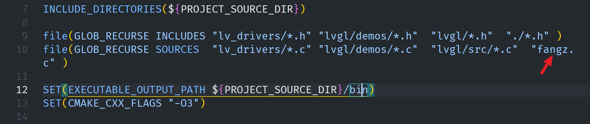

## 文档教程

- https://www.yuque.com/icheima/vzsofu
- https://lvgl.100ask.net/master/index.html

## 入门

### **demo_obj()**

```c
void demo_obj(){
  // 1.得到当前活跃的屏幕
  lv_obj_t* screen = lv_scr_act();

  // 在当前屏幕上显示一个对象（矩形区域）
  lv_obj_t* obj = lv_obj_create(screen);

  // 设置位置
  lv_obj_set_pos(obj,100,50);

  // 设置大小（等效于分别设置宽度和高度）
  lv_obj_set_size(obj,100,100);

  // 设置背景颜色
  lv_obj_set_style_bg_color(obj, lv_palette_main(LV_PALETTE_PINK), 0);
}
```

说明：

- `lv_style_t`：是 样式结构体，可以批量定义一组属性。
- `lv_style_init(&style)`：初始化样式。
- `lv_style_set_width/height/bg_color/radius`：在样式里设置对象的各种外观。
- `lv_obj_add_style(obj, &style, 0)`：把这个样式绑定到对象上（`0` 表示默认状态）。

👉 总结：
 `demo_style` 是通过 样式（style） 来统一控制对象的外观（宽高、颜色、圆角等）。
 相比 `demo_obj`，这种方式更灵活，可以复用样式、动态切换样式，适合复杂 UI 项目。

### demo_style()

```c
void demo_style(){
  lv_obj_t* screen = lv_scr_act();
  lv_obj_t* obj = lv_obj_create(screen);

  // 定义一个样式
  static lv_style_t style;
  lv_style_init(&style);

  // 对象居中对齐
  lv_obj_align(obj, LV_ALIGN_CENTER, 0, 0);

  // 给样式设置属性
  lv_style_set_width(&style, 100);
  lv_style_set_height(&style, 100);
  lv_style_set_bg_color(&style, lv_palette_main(LV_PALETTE_PINK));
  lv_style_set_radius(&style, 20);  // 圆角矩形

  // 将样式应用到对象
  lv_obj_add_style(obj, &style, 0);
}
```

说明：

- `lv_style_t`：是 样式结构体，可以批量定义一组属性。
- `lv_style_init(&style)`：初始化样式。
- `lv_style_set_width/height/bg_color/radius`：在样式里设置对象的各种外观。
- `lv_obj_add_style(obj, &style, 0)`：把这个样式绑定到对象上（`0` 表示默认状态）。

👉 总结：
 `demo_style` 是通过 样式（style） 来统一控制对象的外观（宽高、颜色、圆角等）。
 相比 `demo_obj`，这种方式更灵活，可以复用样式、动态切换样式，适合复杂 UI 项目。

### 显示文本

```c
void demo_label()
{
  lv_obj_t *screen = lv_scr_act();
  lv_obj_t *label = lv_label_create(screen);
  lv_label_set_text(label, "Hello,World!");
  lv_obj_align(label, LV_ALIGN_CENTER, 0, 0);

  // 定义一个样式
  static lv_style_t style;
  lv_style_init(&style);

  // 设置字体（大小由字体本身决定）
  lv_style_set_text_font(&style, &lv_font_montserrat_28); // 28号字体

  // 设置文字颜色
  lv_style_set_text_color(&style, lv_palette_main(LV_PALETTE_RED));

  // 应用样式
  lv_obj_add_style(label, &style, 0);
}
```


### 显示中文

先使用字体转换器：https://lvgl.io/tools/fontconverter

生成带有需要的中文文字的字库文件。

然后把生成的c文件，放到项目的根目录，接着把名字加入到CMakeLists里面(**用空格分隔开不同的名字，不是逗号**)



然后编写代码就好了

```c
void demo_label_chinese()
{
  LV_FONT_DECLARE(fangz);
  // 声明字体
  lv_obj_t *screen = lv_scr_act();
  lv_obj_t *label = lv_label_create(screen);
  lv_label_set_text(label, "你好世界");
  lv_obj_align(label, LV_ALIGN_CENTER, 0, 0);

  // 定义一个样式
  static lv_style_t style;
  lv_style_init(&style);

  // 设置字体（大小由字体本身决定）
  lv_style_set_text_font(&style, &fangz); // 28号字体

  // 设置文字颜色
  lv_style_set_text_color(&style, lv_palette_main(LV_PALETTE_RED));

  // 应用样式
  lv_obj_add_style(label, &style, 0);
}
```

如果编译报错，需要把字体里面的 ` .static_bitmap = 0,` 删掉试试

### 文字滚动

```c
void demo_label_chinese()
{
  LV_FONT_DECLARE(fangz);
  // 声明字体
  lv_obj_t *screen = lv_scr_act();
  lv_obj_t *label = lv_label_create(screen);
  lv_label_set_text(label, "你好世界");
  lv_obj_align(label, LV_ALIGN_CENTER, 0, 0);
  // 限制宽度，让文字显示不下
  lv_obj_set_width(label, 100);
  // 定义一个样式
  static lv_style_t style;
  lv_style_init(&style);

  // 设置字体（大小由字体本身决定）
  lv_style_set_text_font(&style, &fangz); // 28号字体

  // 设置文字颜色
  lv_style_set_text_color(&style, lv_palette_main(LV_PALETTE_RED));
  // 滚动的触发条件是：文字显示不下（超出 label 的宽度），才会进入滚动模式。
  lv_label_set_long_mode(label,LV_LABEL_LONG_SCROLL_CIRCULAR);

  // 应用样式
  lv
```

### 按钮

```c
void event_handler(lv_event_t* event){
  int code = lv_event_get_code(event);
  lv_obj_t * target = lv_event_get_target(event);
  printf("target:%p \n",target);

  if(code == LV_EVENT_CLICKED){
    printf("clicked\r\n");
  }
}
void demo_button(){
  lv_obj_t * screen = lv_scr_act();
  // 创建按钮对象
  lv_obj_t * button = lv_btn_create(screen);
  lv_obj_t * label = lv_label_create(button);
  lv_label_set_text(label,"Hello");

  printf("button:%p \n",button);
  // 居中显示
  lv_obj_center(button);

  // 给按钮添加单击事件
  lv_obj_add_event_cb(button,event_handler,LV_EVENT_CLICKED,NULL);

}
```

### 滑条(slider)

```c
static void slider_event_cb(lv_event_t * e);
static lv_obj_t * slider_label;
void lv_example_slider_1(void)
{
    /*Create a slider in the center of the display*/
    lv_obj_t * slider = lv_slider_create(lv_scr_act());
    lv_obj_center(slider);
    lv_obj_add_event_cb(slider, slider_event_cb, LV_EVENT_VALUE_CHANGED, NULL);

    /*Create a label below the slider*/
    slider_label = lv_label_create(lv_scr_act());
    lv_label_set_text(slider_label, "0%");

    lv_obj_align_to(slider_label, slider, LV_ALIGN_OUT_BOTTOM_MID, 0, 10);
}

static void slider_event_cb(lv_event_t * e)
{
    lv_obj_t * slider = lv_event_get_target(e);
    char buf[8];
    lv_snprintf(buf, sizeof(buf), "%d%%", (int)lv_slider_get_value(slider));
    lv_label_set_text(slider_label, buf);
    lv_obj_align_to(slider_label, slider, LV_ALIGN_OUT_BOTTOM_MID, 0, 10);
}
```

