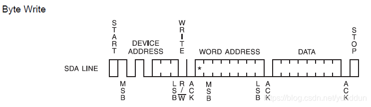

## I2C协议

> **IIC 就是用两根线（SCL 和 SDA），通过“地址+数据”的方式，让一个主设备和多个从设备“打电话”通信的简单协议。** 

### I2C 地址有两种表示方式

#### ① **7位地址（7-bit Address）**：真实设备地址

- 24C02 的固定高4位是 `1010`（由芯片决定）
- 低3位是 A2、A1、A0 引脚电平（可配置）
- 组合成一个 **7位地址**

例如：A2=A1=A0=0 → 地址 = `1010000` = `0x50`

> ✅ 所以你看到 `地址: 0x50` —— 这是 **7位设备地址** 

#### ② **8位地址（8-bit Address）**：实际通信时用的字节

I2C 通信时，主机发送的第一个字节是：

- 高7位：设备地址

- 最低位（bit0）：

  读/写标志位

  - `0`：写（Write）
  - `1`：读（Read）

所以：

- **写操作**：`0x50 << 1 | 0` = `0xA0`
- **读操作**：`0x50 << 1 | 1` = `0xA1`

> ✅ 所以你看到 `(写: 0xA0, 读: 0xA1)` —— 这是 **实际发送的字节** 

#### 设备地址扫描函数

```c
void I2C_Scan(void) {
    uint8_t address;
    uint8_t found = 0;

    printf("I2C 扫描开始...\r\n");

    for (address = 0x08; address <= 0x77; address++) {
        I2C_Start();
        I2C_SendByte(address << 1);  // 发送写地址（7位地址 << 1）
        
        if (I2C_WaitAck() == 0) {    // 收到 ACK
            printf("设备响应，地址: 0x%02X (写: 0x%02X, 读: 0x%02X)\r\n",
                   address,
                   address << 1,
                   (address << 1) | 1);
            found = 1;
        }
        I2C_Stop();
        Delay_ms(2);  // 防止太快
    }

    if (!found) {
        printf("未发现任何 I2C 设备！\r\n");
        printf("请检查：接线、上拉电阻、电源、设备地址！\r\n");
    } else {
        printf("I2C 扫描完成。\r\n");
    }
}
```

输出结果：

```
设备响应，地址: 0x50 (写: 0xA0, 读: 0xA1)
```

> 如果扫描函数扫描出来超级多的地址，大概率是因为没有初始化软件I2C

### I2C 起始信号

> **起始信号（Start Condition）** 是 I²C 总线上传输数据前的**特殊时序信号**，用来标识 **一次通信的开始**。

- **条件**：
  - 当 **SCL为高电平**时，
  - SDA 由 **高电平 → 低电平** 变化。

> 注意：SCL必须保持高电平时 SDA 拉低，这样总线上的所有设备才能识别这是起始信号，而不是普通数据。

```
空闲总线：
SCL: ────────
SDA: ────────  （上拉电阻拉高）

发起 起始信号：
SCL: ────────
SDA: ─┐
      └───────  （高 → 低）
```

**STM32 软件实现示例（模拟 I²C）**

```c
// SDA 拉高/低函数、SCL 拉高/低函数假设已经定义
void I2C_Start(void) {
    SDA_H();   // SDA 高
    SCL_H();   // SCL 高
    Delay_us(5);

    SDA_L();   // SDA 高->低 触发起始信号
    Delay_us(5);

    SCL_L();   // 拉低 SCL 开始传输
}
```

> 为什么需要延时，以及为什么最后需要SCL_L
>
> ###### 1. 延时可以保证 SDA/SCL 达到稳定的高低电平，防止误触发。
>
> ###### 2. SDA 变化只能在 SCL 低电平时发生（除了起始和停止信号），所以在起始信号产生后，要先 拉低 SCL，才能安全发送后续地址和数据。

### SCL时钟

“时钟”就是 SCL 高低变化形成的节奏信号，它告诉接收方什么时候读取数据，主机什么时候准备下一位数据。在软件 I2C 中，SCL 的拉高拉低就是人为产生这个时钟。

### SCL和SDA

**SCL 拉低**：准备/设置 SDA，为下一位或等待 ACK 做准备

**SCL 拉高**：SDA 必须稳定，不允许随意拉高或拉低（除非是产生 START/STOP 信号），让接收方读取数据或应答，并让主机检测 ACK

SDA为高，数据为1，释放SDA

SDA为低，数据为0

### MSB和LSB

表示高位在前和地位在前的意思

### 发送一个字节

> 就是循环的发送八位数据到SDA总线上面
>
> 首先SCL拉低开始传输数据到SDA，通过数据&0x80，判断要发送的这一位数据是1还是0，继而控制SDA是1还是0，接着延时，把SCL拉高，从机接收这一位数据，延时，拉低，向左移位，开始下一位的数据传输

**发送一个字节的 8 位数据（MSB→LSB）** 的核心流程：

1. 循环 8 次，每次发送一位
2. SDA 在 SCL 低电平时设置数据
3. SCL 上升沿时从机采样
4. SCL 拉低准备下一位
5. byte 左移为下一位做准备

**STM32 软件实现示例（模拟 I²C）**

```c
// 发送一个字节（8位）到 I²C 总线
void MyI2C_SendByte(uint8_t byte) {
    uint8_t i;

    for (i = 0; i < 8; i++) {   // 循环发送8位数据，从最高位（MSB）开始
        SCL_L;                  // 拉低 SCL，为改变 SDA 做准备（I2C规定：SDA在SCL低电平时改变）
        Delay_us(2);             // 延时，保证SCL低电平稳定

        // 判断当前最高位是0还是1，设置 SDA 电平
        if (byte & 0x80) {       
            SDA_H;              // 当前位为1，SDA拉高
        } else {
            SDA_L;              // 当前位为0，SDA拉低
        }
        Delay_us(2);             // 延时，保证SDA电平稳定

        SCL_H;                  // 拉高SCL，上升沿从机采样当前SDA电平
        Delay_us(5);             // 保持SCL高电平一段时间，让从机稳定采样
        SCL_L;                  // 拉低SCL，为下一位发送做准备

        byte <<= 1;              // 左移一位，下一位移到最高位，准备循环发送
    }
}

```


### 等待从机应答

等待从机应答可以总结为：

1. 拉低 SCL。
2. 释放 SDA（SDA_H 或配置为输入）。
3. 拉高 SCL，检查 SDA。
4. SDA = 0 → 收到 ACK
   SDA = 1 → 没有 ACK
5. 拉低 SCL，准备下一个字节。

STM32 软件 I2C 示例

```c
uint8_t MyI2C_WaitAck(void)
{
    SCL_L;       // 先拉低 SCL，准备时钟
    Delay_us(2);

    SDA_H;       // 释放 SDA，作为输入
    Delay_us(2);

    SCL_H;       // 拉高 SCL，让从机驱动 SDA
    Delay_us(5);

    if (SDA_READ) // 如果 SDA 还是高电平
    {
        SCL_L;
        return 1; // 表示没有收到 ACK
    }

    SCL_L;
    return 0; // 收到 ACK
}

```

### I2C 停止信号

在 I2C 协议中：

- **STOP 信号**用于表示 **一次通信结束**，总线空闲。
- STOP 信号是 **SDA 由低电平变为高电平，同时 SCL 为高电平**。


### 24C02字节写时序

这部分的内容应结合上文：I2C总线的数据传送的内容一起理解。



1. 开始位，后面紧跟从器件地址位（0xA0），等待应答，这是为了在IIC总线上确定24C02的从地址位置；
2. 确定操作24C02的地址，等待应答，也就是将字节写入到24C02中256个字节中的位置；
3. 确定需要写入24C02芯片的字节，等待应答，停止位。


## 读取多个字节

```c
#include "stm32f10x.h"
#include "MyI2C.h"
#include "AT24C02.h"
#include "usart.h"
#include <stdio.h>
#include "Delay.h"
int main(void)
{
    USART2_Init(115200);
    MyI2C_Init();

    uint16_t i;
    uint8_t data[256];
    for (i = 0; i < 256; i++)
    {
        AT24C02_WriteByte(i, i);
        Delay_ms(5);
    }
    AT24C02_ReadBuffer(0, data, 256);
    for (int i = 0; i < 256; i++)
    {
        printf("Data[%d] = %d\n", i, data[i]);
    }
}
```
