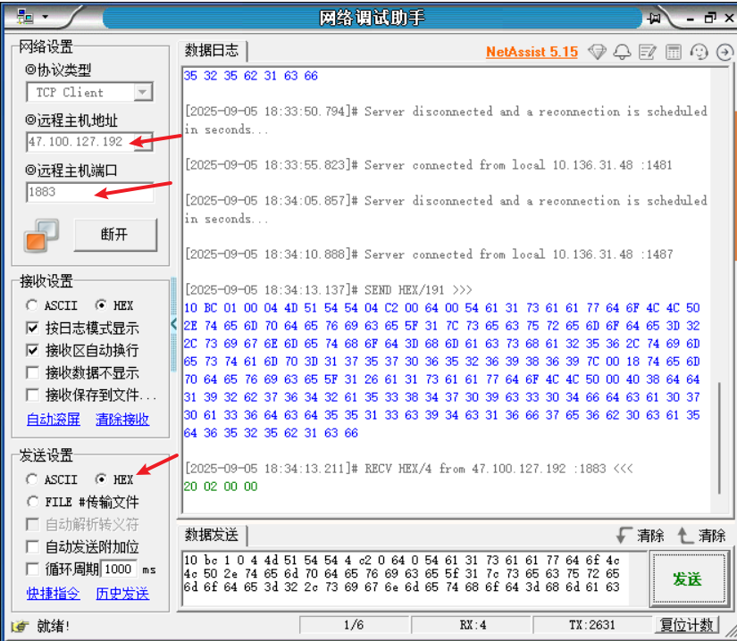

## 调试



## 可变报头的可变

### 1. **固定报头 (Fixed Header)**

- 每个 MQTT 报文都有固定报头，长度至少 2 字节：
  - 第 1 字节：报文类型、DUP、QoS、Retain
  - 剩余长度：表示后面整个报文（可变报头 + 有效载荷）的字节数，剩余长度最高位是否置位来分析
- 固定报头的 **格式固定**，但剩余长度可以用 1–4 个字节编码，所以它长度也是“可变”的。

------

### 2. **可变报头 (Variable Header)**

- 「可变」的意思不是说这个部分的名字变，而是 **不同类型报文里，它的字段和长度都不一样**。
- 举几个例子：

| 报文类型               | 可变报头内容                                        | 是否固定长度         |
| ---------------------- | --------------------------------------------------- | -------------------- |
| **CONNECT**            | 协议名、版本号、连接标志、KeepAlive 等              | 固定格式（10字节起） |
| **CONNACK**            | 连接确认标志、返回码                                | 2 字节               |
| **PUBLISH**            | **主题名(长度+内容)，如果 QoS>0，还要加报文标识符** | 长度不固定           |
| **SUBSCRIBE**          | 报文标识符                                          | 2 字节               |
| **PINGREQ / PINGRESP** | 没有可变报头                                        | —                    |

👉 所以叫 **Variable Header**，就是因为它的存在与否、内容和长度 **取决于报文类型**。

------

### 3. **你的例子 (PUBLISH 报文)**

- 可变报头 = `00 22`(长度=34) + 主题名(34字节)
- 因为 QoS=0，没有报文标识符。
- 如果 QoS=1 或 2，就会在主题后面多 2 个字节（Packet Identifier）。

------

✅ 总结：
 可变报头的“可变”不是指「某一字段本身可变」，而是指 **不同报文类型、不同设置下，可变报头的内容和长度不同**。

## 分析publish报文

#### 原始报文

```
30 75 00 22 2F 61 31 73 61 61 77 64 6F 4C 4C 50 2F 74 65 6D 70 64 65 76 69 63 65 5F 31 2F 75 73 65 72 2F 67 65 74 7B 22 6D 65 74 68 6F 64 22 3A 22 74 68 69 6E 67 2E 65 76 65 6E 74 2E 70 72 6F 70 65 72 74 79 2E 70 6F 73 74 22 2C 22 70 61 72 61 6D 73 22 3A 7B 22 4C 69 67 68 74 53 77 69 74 63 68 22 3A 30 7D 2C 22 76 65 72 73 69 6F 6E 22 3A 22 31 2E 30 22 7D
=======解析成下面======
30 75 //消息类型，剩余长度
00 22 // 2 字节，表示主题名长度
2F 61 31 73 61 61 77 64 6F 4C 4C 50 2F 74 65 6D 70 64 65 76 69 63 65 5F 31 2F 75 73 65 72 2F 67 65 74 //主题名
7B 22 6D 65 74 68 6F 64 22 3A 22 74 68 69 6E 67 2E 65 76 65 6E 74 2E 70 72 6F 70 65 72 74 79 2E 70 6F 73 74 22 2C 22 70 61 72 61 6D 73 22 3A 7B 22 4C 69 67 68 74 53 77 69 74 63 68 22 3A 30 7D 2C 22 76 65 72 73 69 6F 6E 22 3A 22 31 2E 30 22 7D //有效载荷
```

------

#### 固定报头 (Fixed Header)

- `0x30` → `0011 0000`
  - 位7-4：报文类型 = `0011` (PUBLISH)
  - 位3：DUP = 0 (第一次发送)
  - 位2-1：QoS = 0 (最多一次)
  - 位0：Retain = 0 (不保留)

👉 所以这是 **QoS 0 的 PUBLISH 报文**。

- `0x75 = 117` → 剩余长度 (Remaining Length = 117 字节)
   表示后面还有 117 字节属于这个报文。

------

#### 可变报头 (Variable Header)

- `00 22` → 主题名长度 (Topic Name Length = 0x0022 = 34 字节)

- 主题字符串 (34 字节)：

  ```
  2F 61 31 73 61 61 77 64 6F 4C 4C 50 2F 74 65 6D 70 64 65 76 69 63 65 5F 31 2F 75 73 65 72 2F 67 65 74
  ```

  转成 ASCII：

  ```
  /a1saawdoLLP/tempdevice_1/user/get
  ```

👉 这是阿里云物联网平台里典型的 **设备上行 Topic**。

- 因为 **QoS = 0**，所以这里没有 Packet Identifier。

------

#### 有效载荷 (Payload)

剩余部分就是消息内容：

```
7B 22 6D 65 74 68 6F 64 22 3A 22 74 68 69 6E 67 2E 65 76 65 6E 74 2E 70 72 6F 70 65 72 74 79 2E 70 6F 73 74 22 2C 22 70 61 72 61 6D 73 22 3A 7B 22 4C 69 67 68 74 53 77 69 74 63 68 22 3A 30 7D 2C 22 76 65 72 73 69 6F 6E 22 3A 22 31 2E 30 22 7D
```

转成字符串：

```
{
  "method": "thing.event.property.post",
  "params": {
    "LightSwitch": 0
  },
  "version": "1.0"
}
```

👉 这是阿里云设备上报属性的 **标准 JSON 格式**。

------

#### 最终解析结果

- **报文类型**: PUBLISH

- **QoS**: 0

- **主题 (Topic)**: `/a1saawdoLLP/tempdevice_1/user/get`

- **消息 (Payload)**:

  ```
  {
    "method": "thing.event.property.post",
    "params": {
      "LightSwitch": 0
    },
    
  ```