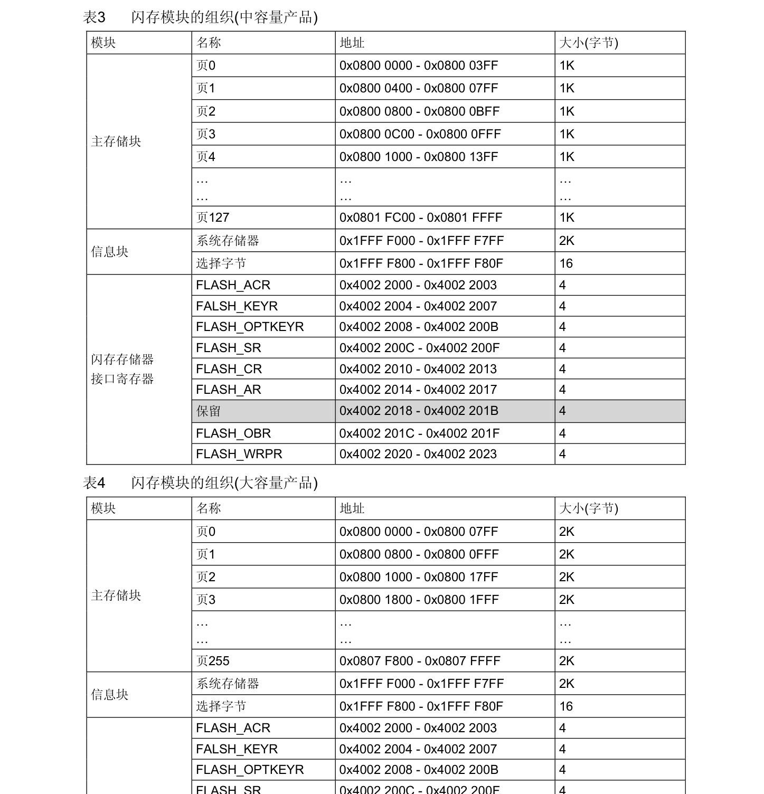

## 容量划分

C8T6中的8

```
8：Flash存储器容量
4 = 16KB  flash（小容量）
6 = 32KB  flash（小容量）
8 = 64KB  flash（中容量）
B = 128KB flash（中容量）
C = 256KB flash（大容量）
D = 384KB flash（大容量）
E = 512KB flash（大容量）
F = 768KB flash（大容量）
G = 1MKB  flash（大容量）
```



例如；STM32F103ZET6 的 Flash 特性

- Flash 容量：**512KB**
- 起始地址：`0x0800 0000`
- 每页大小：**2KB (0x800)**
- 总页数：`512KB ÷ 2KB = 256 页`

## 注意点

因为应用程序已经存在在flash里面了，所以测试的时候，不要从0开始，不然会损坏当前在单片机里面的程序。


！！！先擦除在读写


