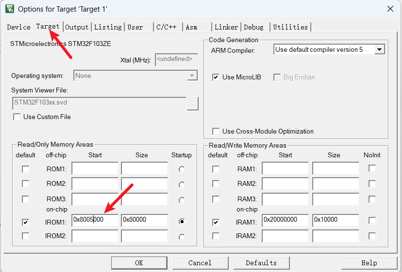
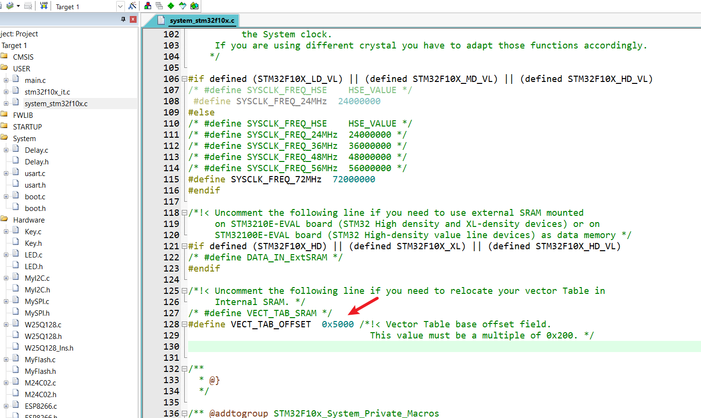
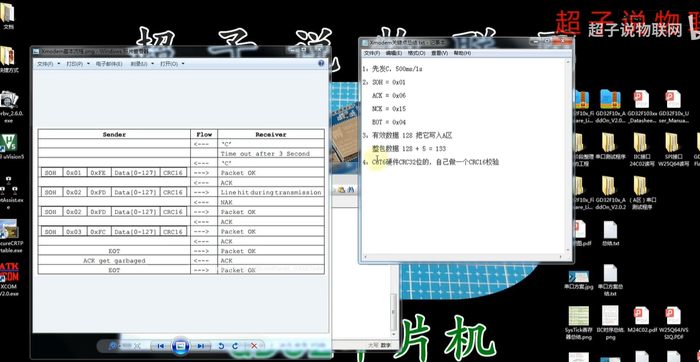
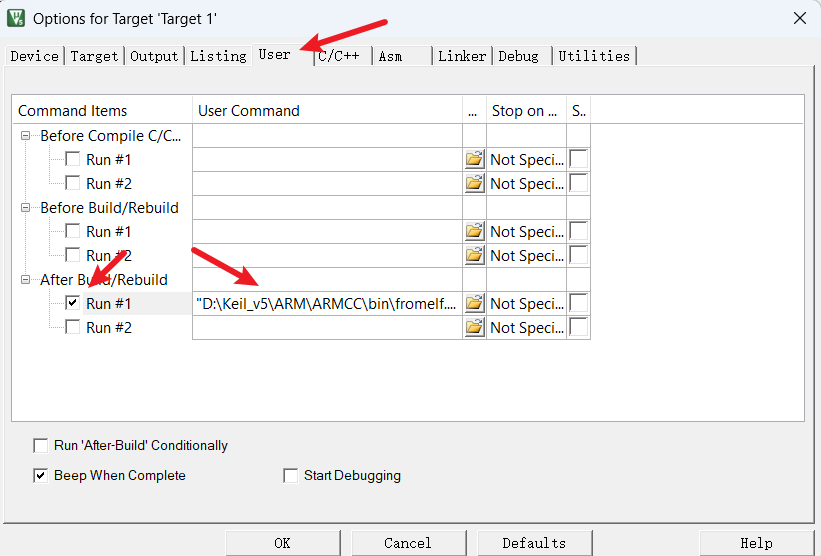
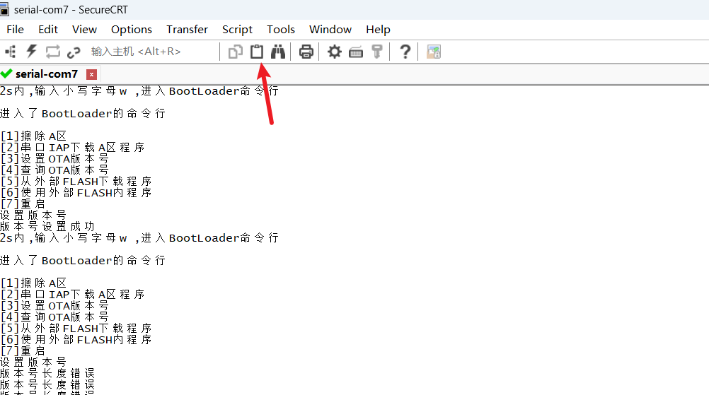
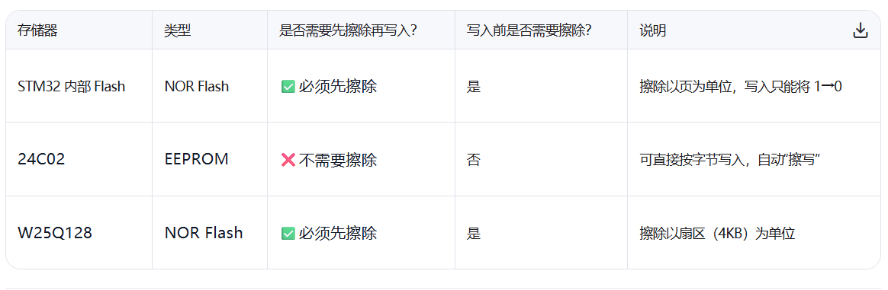

## 介绍

### 系统自带的Bootloader

**系统自带的 Bootloader** 则是 STM32 芯片厂家（ST 公司）在出厂时 **固化在片内 ROM（系统存储区 System Memory）** 的一段程序，不会被擦除。

它的主要功能是：
 👉 在芯片没有用户程序（或者用户强制进入 Boot 模式）时，提供一种“下载/烧录新程序”的方式。

换句话说，它就是 官方提供的“应急烧录器”。
 当你没法用 SWD/JTAG 烧录器时，还可以通过这个 Bootloader，把程序从 串口 / USB / CAN / I²C / SPI 等接口下载进 Flash。

### 工作原理

1. **上电/复位后**，芯片会根据 **BOOT 引脚状态** 决定从哪里启动：
   - BOOT0=0 → 从 **主 Flash** 启动（用户程序）。
   - BOOT0=1 → 从 **系统存储区（System Memory）** 启动，也就是运行 **ST 内置 Bootloader**。
2. **进入系统 Bootloader** 后：
   - Bootloader 会初始化对应外设（比如 USART1）。
   - 等待上位机（比如 ST 的 Flash Loader 工具，或 STM32CubeProgrammer）通过协议发送下载命令。
   - 收到命令后，就能把新程序写入 Flash。

## 串口

**STM32 串口 + DMA + 空闲中断 + 缓冲区** 的经典方案

> 这个方案在 高效率、不丢数据 的场景下非常常见，比如用 ESP8266/ESP32 AT指令 或 大批量传感器数据采集。

2. 工作流程

1. **初始化DMA循环接收**
   - 设置 DMA 通道，把串口的 `DR寄存器` 绑定到一块 **循环缓冲区**。
   - 配置 DMA 长度，比如 256字节。
   - 启动 DMA 循环模式，这样 DMA 会一直把收到的数据存到缓冲区。
2. **开启串口空闲中断**
   - 当 UART 发现一段时间没有数据输入，就触发 **空闲中断**。
   - 在空闲中断里，可以认为“这一帧数据到头了”。
3. **计算接收长度**
   - 在空闲中断 ISR 中：
     - 先清除空闲中断标志。
     - 关闭 DMA。
     - 根据 `接收缓冲区长度 - DMA当前的CNDTR寄存器值` 算出本次接收的数据长度。
     - 把数据拷贝到用户处理缓冲区。
     - 重新开启 DMA。
4. **用户处理数据**
   - 应用层就能拿到一帧完整的数据，进行协议解析，比如 MQTT 消息、AT指令、Modbus 帧。

## AB分区规划

ZET6 512KB 一页2KB，一共256页 0~255

B区 40K 0~19

A区 80K 20~63

## keil设置跳转



然后



## 分区跳转的两大任务

1. 设置sp，A区的起始地址给到sp
2. 设置pc，A区的起始位置+4给到pc

补充：把我们在B区用到的外设，寄存器reset

## 分区跳转的过程

A区设置向量表的地址和下载的地址，B区判断之后，跳转到A区的地址

跳转后A区要启动中断

```
__enable_irq();   // 确保中断打开
```

172.20.10.2

## 细节问答

1. **谁将OTA_flag变成对勾？**
   A区
2. **什么时候将OTA_flag变成对勾？**
   A区下载完毕之后
3. **OTA时，最新版本的程序文件下载到哪？**
   分片下载，[256], W25Q64中
4. **OTA时，最新版本的程序文件如何下载？下载多少？**
   服务器下发告诉我们上传的新版本程序的大小，字节数
5. **下载多少这个变量用不用保存？**
   用，保存到24C02
6. **发生OTA事件时，B区如何更新A区？**
   根据保存在24C02中的下载量，拿数据，写到A区

## Xmodem基本流程

> Xmodem 128字节包标准长度为 133（SOH+包号+包号反码+128字节数据+2字节CRC），但实际传输可能会有偏差，建议先打印 `datalen` 和 `data[0]`，确认是否收到完整包。



## CRC校验

在线校验工具：http://www.ip33.com/crc.html

### 实现代码

```c
uint16_t Xmodem_CRC16(uint8_t *data, uint16_t datalen)
{
    uint16_t crc = 0x0000;
    uint16_t i;

    while (datalen--) {
        crc ^= ((uint16_t)(*data++) << 8); // 通过异或（^=）把新字节混入寄存器，将字节放到高 8 位，新来的字节要放在 左边的高 8 格（bit15~bit8），这样每次左移时，它会慢慢进入最高位，逐位计算。如果放在低 8 位，那它根本走不到最高位，CRC 就算错了
        for (i = 0; i < 8; i++) {
            if (crc & 0x8000) {
                crc = (crc << 1) ^ 0x1021;
            } else {
                crc = (crc << 1);
            }
        }
    }
    return crc;
}

```

## Keil生成bin格式文件



```
"D:\Keil_v5\ARM\ARMCC\bin\fromelf.exe" --bin "Objects\Project.axf" --output "Objects\Project.bin"
```

然后编译就会自动生成bin文件

## 串口IAP关键代码

```c
if (BootStaFlag & IAP_XMODEM_D_FLAG)
  {
    // 接收数据包（Xmodem 128 bytes）
    if ((datalen == 133) && (data[0] == 0x01))
    {
      BootStaFlag &= ~IAP_XMODEM_C_FLAG; // 清掉C模式标志

      // 计算 CRC
      UpdateA.XmodemCRC = Xmodem_CRC16(&data[3], 128);

      // 校验 CRC
      if (UpdateA.XmodemCRC == (data[131] * 256 + data[132]))
      {
        uint16_t packet_index = UpdateA.XmodemNB % (STM32_PAGE_SIZE / 128); // 一页可以放16个包
        // 直接计算当前包在页内的偏移位置
        uint32_t buff_offset = packet_index * 128;

        // 拷贝数据到缓冲区
        memcpy(&UpdateA.Updatebuff[buff_offset], &data[3], 128);
        UpdateA.XmodemNB++; // 包计数递增

        // 每满一页写入 Flash (关键修复：地址计算和字数量)
        if ((UpdateA.XmodemNB % (STM32_PAGE_SIZE / 128)) == 0)
        {
          uint32_t page_index = (UpdateA.XmodemNB / (STM32_PAGE_SIZE / 128)) - 1;
          uint32_t flash_addr = STM32_A_SADDR + (page_index * STM32_PAGE_SIZE);

          // 传入字数量 = 页大小(2048) / 4
          Flash_WriteWords(flash_addr,
                           (uint32_t *)UpdateA.Updatebuff,
                           STM32_PAGE_SIZE / 4); // 2048/4=512 words
        }
        printf("\x06"); // ACK
      }
      else
      {
        printf("\x15"); // NAK
      }
    }

    // 接收结束标志（EOT）
    if ((datalen == 1) && (data[0] == 0x04))
    {
      printf("\x06"); // ACK

      // 写入剩余不足一页的数据
      uint16_t packets_remain = UpdateA.XmodemNB % (STM32_PAGE_SIZE / 128);
      if (packets_remain != 0)
      {
        uint32_t page_index = UpdateA.XmodemNB / (STM32_PAGE_SIZE / 128);
        uint32_t flash_addr = STM32_A_SADDR + (page_index * STM32_PAGE_SIZE);
        uint32_t byte_count = packets_remain * 128;

        // 传入字数量 = 字节数 / 4
        Flash_WriteWords(flash_addr,
                         (uint32_t *)UpdateA.Updatebuff,
                         byte_count / 4);
      }

      BootStaFlag &= ~IAP_XMODEM_D_FLAG;
      Delay_ms(100);
      NVIC_SystemReset(); // 系统复位
    }
  }
```

注意点，FLASH写入是按字的单位写入的。

一次写32位，4个字节，写多少次，就是2048/4

## 设置版本号

格式：

```
VER-1.0.0-2025/09/04-15:04
```



点这个粘贴

## flash区别



##  把外部 W25Q128 上的程序刷到 STM32 内部 Flash
