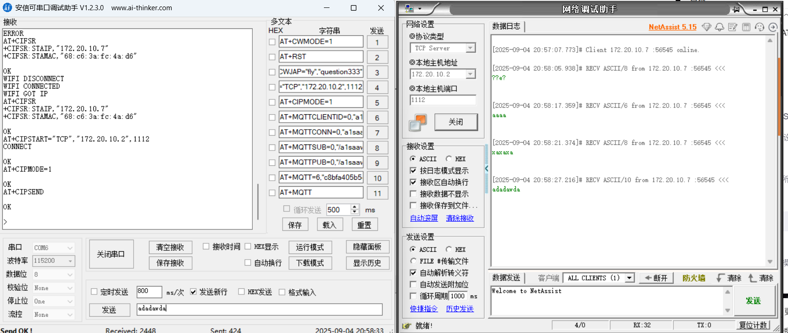
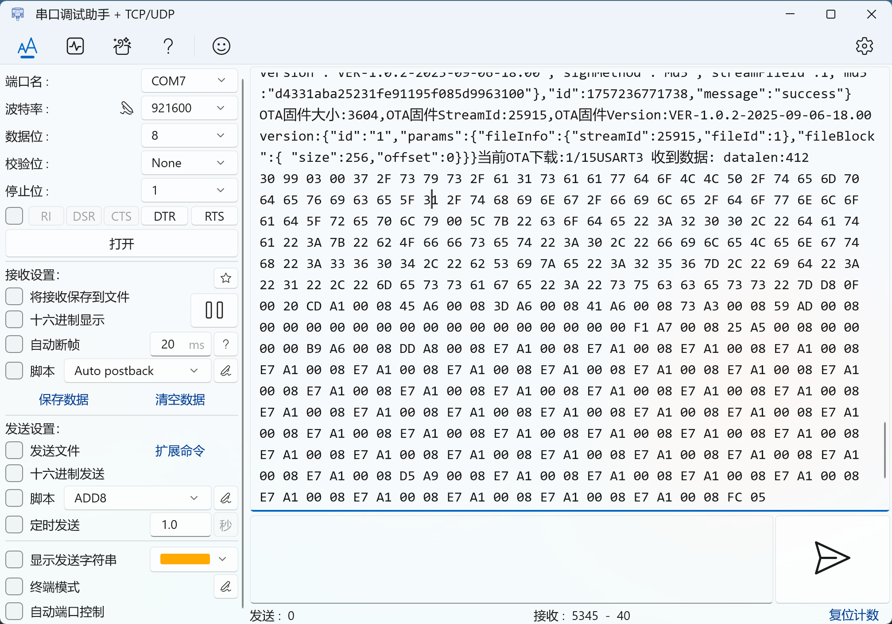
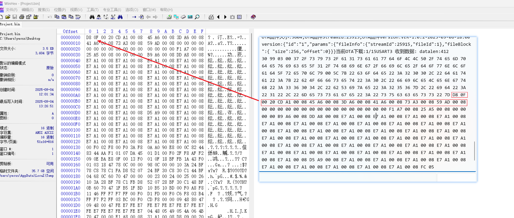
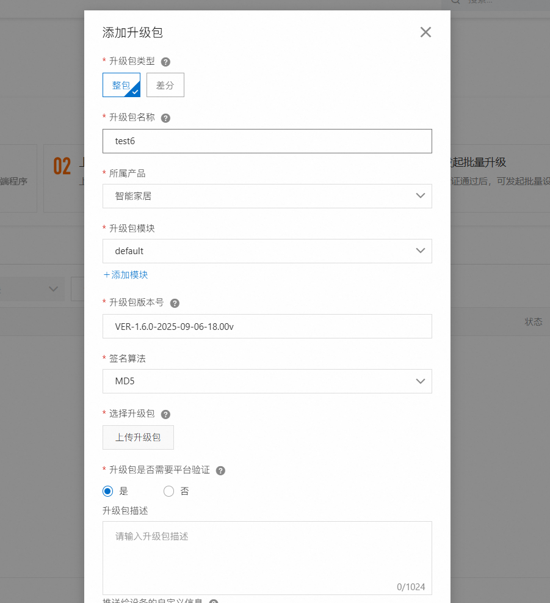
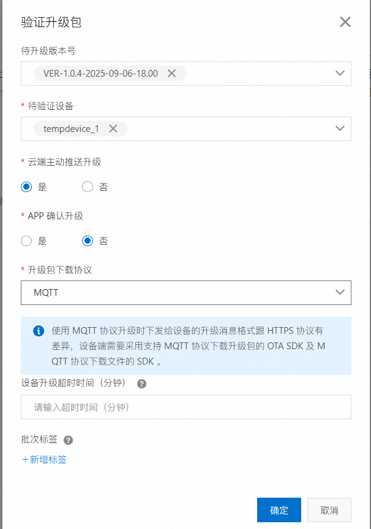

## 透传

https://blog.csdn.net/Xiaomo_haa/article/details/108514149



查询IP地址

```
AT+CIFSR
```

退出透传

```
+++
注意：不带\r\n！！！
```

## 版本号

```
VER-1.0.0-2025-09-06-18.00
```

### 固件版本号上报格式

```
{"id":"123","params":{"version":"1.0.1"}}
```

上报的时机，订阅成功后

接收到的推送

```
/ota/device/upgrade/a1saawdoLLP/tempdevice_1{"code":"1000","data":{"size":3612,"streamId":25914,"sign":"2fe44e2dee3d50fb0478aaa2e5f184bc","dProtocol":"mqtt","version":"VER-1.0.1-2025-09-06-18.00","signMethod":"Md5","streamFileId":1,"md5":"2fe44e2dee3d50fb0478aaa2e5f184bc"},"id":1757232295633,"message":"success"}
```

```
/ota/device/upgrade/a1saawdoLLP/tempdevice_1{"code":"1000","data":{"size":%d,"streamId":%d,"sign":"%*32s","dProtocol":"mqtt","version":"%26s","signMethod":"Md5","streamFileId":1,"md5":"%*32s"},"id":%*d,"message":"success"}
```

## 官方文档

https://help.aliyun.com/zh/iot/user-guide/perform-ota-updates?spm=5176.11485173.console-base_help.dexternal.4ea270d8LSoqGr&scm=20140722.S_help%40%40%E6%96%87%E6%A1%A3%40%4085700.S_BB1%40bl%2BBB2%40bl%2BRQW%40ag0%2Bhot%2Bos0.ID_85700-RL_ota%E5%8D%87%E7%BA%A7-LOC_console~UND~help-OR_ser-PAR1_2150442e17572260493115843e6b3c-V_4-P0_3-P1_0

分片下载：https://help.aliyun.com/zh/iot/user-guide/ota-update?scm=20140722.S_help%40%40%E6%96%87%E6%A1%A3%40%4089307._.ID_help%40%40%E6%96%87%E6%A1%A3%40%4089307-RL_%E5%88%86%E7%89%87%E4%B8%8B%E8%BD%BD-LOC_doc%7EUND%7Eab-OR_ser-PAR1_212a5d3d17572337676866273dadd4-V_4-PAR3_r-RE_new6-P0_0-P1_0&spm=a2c4g.11186623.help-search.i52#section-vst-2w8-cej

### 下载固件

```
{
    "id": "123456",
    "version": "1.0",
    "params": {
        "fileToken":"1bb8***",
        "fileInfo":{
            "streamId":1234565,
            "fileId":1
        },
        "fileBlock":{
            "size":256,
            "offset":2
        }
    }
}
```

```
{"id":"1","params":{"fileInfo":{"streamId":1234565,"fileId":1},"fileBlock":{ "size":256,"offset":2}}}
```

### 分片下载报文分析



```
当前OTA下载:1/15USART3 收到数据: datalen:412
30 99 03 00 37 2F 73 79 73 2F 61 31 73 61 61 77 64 6F 4C 4C 50 2F 74 65 6D 70 64 65 76 69 63 65 5F 31 2F 74 68 69 6E 67 2F 66 69 6C 65 2F 64 6F 77 6E 6C 6F 61 64 5F 72 65 70 6C 79 00 5C 7B 22 63 6F 64 65 22 3A 32 30 30 2C 22 64 61 74 61 22 3A 7B 22 62 4F 66 66 73 65 74 22 3A 30 2C 22 66 69 6C 65 4C 65 6E 67 74 68 22 3A 33 36 30 34 2C 22 62 53 69 7A 65 22 3A 32 35 36 7D 2C 22 69 64 22 3A 22 31 22 2C 22 6D 65 73 73 61 67 65 22 3A 22 73 75 63 63 65 73 73 22 7D D8 0F 00 20 CD A1 00 08 45 A6 00 08 3D A6 00 08 41 A6 00 08 73 A3 00 08 59 AD 00 08 00 00 00 00 00 00 00 00 00 00 00 00 00 00 00 00 F1 A7 00 08 25 A5 00 08 00 00 00 00 B9 A6 00 08 DD A8 00 08 E7 A1 00 08 E7 A1 00 08 E7 A1 00 08 E7 A1 00 08 E7 A1 00 08 E7 A1 00 08 E7 A1 00 08 E7 A1 00 08 E7 A1 00 08 E7 A1 00 08 E7 A1 00 08 E7 A1 00 08 E7 A1 00 08 E7 A1 00 08 E7 A1 00 08 E7 A1 00 08 E7 A1 00 08 E7 A1 00 08 E7 A1 00 08 E7 A1 00 08 E7 A1 00 08 E7 A1 00 08 E7 A1 00 08 E7 A1 00 08 E7 A1 00 08 E7 A1 00 08 E7 A1 00 08 E7 A1 00 08 E7 A1 00 08 E7 A1 00 08 E7 A1 00 08 E7 A1 00 08 E7 A1 00 08 E7 A1 00 08 E7 A1 00 08 E7 A1 00 08 E7 A1 00 08 E7 A1 00 08 D5 A9 00 08 E7 A1 00 08 E7 A1 00 08 E7 A1 00 08 E7 A1 00 08 E7 A1 00 08 E7 A1 00 08 E7 A1 00 08 E7 A1 00 08 E7 A1 00 08 FC 05 
```



> 报文类型+剩余长度+主体名称+json

```
0 [99] [03] [00] 7 /sys/a1saawdoLLP/tempdevice_1/thing/file/download_reply [00] \ {"code":200,"data":{"bOffset":0,"fileLength":3604,"bSize":256},"id":"1","message":"success"}
```

### 云平台流程




