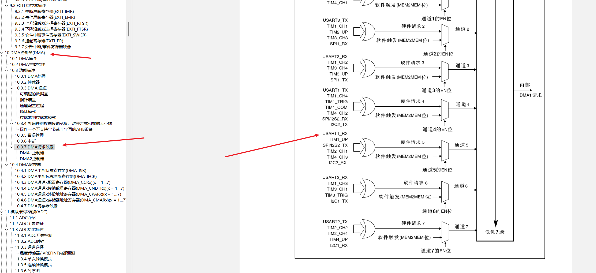

## 概述

STM32 中的 UART 允许使用不同的发送（`TX`）和接收（`RX`）模式进行配置：

- 轮询模式（无 DMA，无 IRQ）
  - P：应用程序正在轮询状态位，以检查是否有任何字符已被发送/接收，并以足够快的速度读取，以免错过任何字节
  - P：易于实现，只需几行代码
  - C：如果 CPU 不能足够快地读取寄存器，则在复杂的应用程序中很容易丢失接收到的数据
  - C：仅适用于低波特率`9600`或更低
- 中断模式（无 DMA）
  - P：UART触发中断，CPU跳转到服务程序，分别处理每个接收到的字节
  - P：嵌入式应用中常用的方法
  - P：适用于常见波特率，`115200`最高`~921600`可达
  - C：每收到一个字符就执行一次中断服务程序
  - C：如果高速波特率的每个字符都触发中断，可能会降低系统性能
- DMA模式
  - DMA 用于在硬件层面将数据从 USART RX 数据寄存器传输到用户内存。此时无需任何应用程序交互，除非应用程序在必要时处理接收到的数据。
  - P：从 USART 外设到内存的传输在硬件级别完成，无需 CPU 交互
  - P：可以非常轻松地与操作系统配合使用
  - P：针对最高波特率`> 1Mbps`和低功耗应用进行了优化
  - P：在数据突发的情况下，增加数据缓冲区大小可以提高功能性
  - C：DMA 硬件必须提前知道要传输的字节数
  - C：如果通信失败，DMA 可能不会通知应用程序所有已传输的字节

## 1、轮询

### 初始化步骤

1. 打开USART和GPIO的时钟
2. 配置TX和RX的GPIO
3. 配置USART的波特率，奇偶校验，数据位，停止位，流控制
4. 启动串口

### 发送一个字节

```c
USART_SendData(USART1,data);
```

但是发送之前得先查看是不是有空，怎么查，通过标志位查

下面是所有的标志位

```
  *     @arg USART_FLAG_CTS:  CTS Change flag (not available for UART4 and UART5)
  *     @arg USART_FLAG_LBD:  LIN Break detection flag
  *     @arg USART_FLAG_TXE:  Transmit data register empty flag
  *     @arg USART_FLAG_TC:   Transmission Complete flag
  *     @arg USART_FLAG_RXNE: Receive data register not empty flag
  *     @arg USART_FLAG_IDLE: Idle Line detection flag
  *     @arg USART_FLAG_ORE:  OverRun Error flag
  *     @arg USART_FLAG_NE:   Noise Error flag
  *     @arg USART_FLAG_FE:   Framing Error flag
  *     @arg USART_FLAG_PE:   Parity Error flag
```

使用 `USART_FLAG_TXE`

```c
while (USART_GetFlagStatus(USART1,USART_FLAG_TXE)==RESET); //当这个标志位没有被置位的时候，无限等待
USART_SendData(USART1,data);
```

### 发送字符串

通过发送字节的函数，无限自增字符串即可发送出去

```c
void USART1_SendString(char *str)
{
    while(*str)
    {
        USART1_SendByte(str++);
    }
}
```

### 接收一个字节

```c
USART_ReceiveData(USART1);
```

什么时候接收呢，也得有数据再接收，在主循环里面不断判断接收数据寄存器是否非空

```c
	while (1)
	{
		while (USART_GetFlagStatus(USART1, USART_FLAG_RXNE) != RESET)
		{
			recv = USART_ReceiveData(USART1);
			USART1_SendByte(recv); // 回传
		}
	}
```


## 2、串口中断接收

### 初始化步骤

1. 打开USART和GPIO的时钟
2. 配置TX和RX的GPIO
3. 配置USART的波特率，奇偶校验，数据位，停止位，流控制
4. 使能接收中断
5. 配置NVIC
6. 启动USART1
7. 配置中断服务函数

### 中断服务函数

最简单的回显ISR

```c
void USART1_IRQHandler(void)
{
    uint8_t res;
    if (USART_GetITStatus(USART1, USART_IT_RXNE) != RESET)
    {
        res = USART_ReceiveData(USART1);
		USART1_SendByte(res);
        USART_ClearITPendingBit(USART1, USART_IT_RXNE);
    }
}
// 每接收一个字节，RXNE 就会置位一次 → 触发一次中断
```

将收到的数据存到缓冲区的ISR

注意，在ISR里面我们需要通过数据帧的结束标志（如换行符 `\n`）去判断接收到的这一帧数据的结束，然后再去输出，否则还没接收完就输出了。

main.c

```c
while (1)
	{
		// 检查接收是否完成
		if (USART1_RX_DONE)
		{
			USART1_SendString("You Sent: ");

			// 发送接收到的数据
			for (i = 0; i < USART1_RX_LEN; i++)
			{
				USART1_SendByte(USART1_RX_BUF[i]);
			}

			USART1_SendString("\r\n");

			// 重置接收状态
			USART1_RX_LEN = 0;
			USART1_RX_DONE = 0;
		}
	}
```

usart.h

```c
void USART1_IRQHandler(void)
{
    uint8_t res;
    if (USART_GetITStatus(USART1, USART_IT_RXNE) != RESET)
    {
        res = USART_ReceiveData(USART1);
        // 检查是否已接收完成
        if (USART1_RX_DONE!=1)
        {
            // 检测到换行符表示帧结束
            if (res == '\n')
            {
                USART1_RX_DONE = 1; // 标记接收完成
                // 注意：换行符不存入缓冲区
            }
            else
            {
                // 检查缓冲区是否还有空间
                if (USART1_RX_LEN < USART1_RX_BUF_SIZE)
                {
                    USART1_RX_BUF[USART1_RX_LEN++] = res;
                }
                else
                {
                    // 缓冲区满时强制完成
                    USART1_RX_DONE = 1;
                }
            }
        }
        // 清除中断标志位
        USART_ClearITPendingBit(USART1, USART_IT_RXNE);
    }
}
```

## 3、串口DMA接收

### DMA通道

首先查看手册，确定通道



https://www.cnblogs.com/yecss/p/19084621

## 参考

- https://github.com/MaJerle/stm32-usart-uart-dma-rx-tx
- https://github.com/Prry/stm32-uart-dma
- https://blog.csdn.net/wsq_666/article/details/124619656
