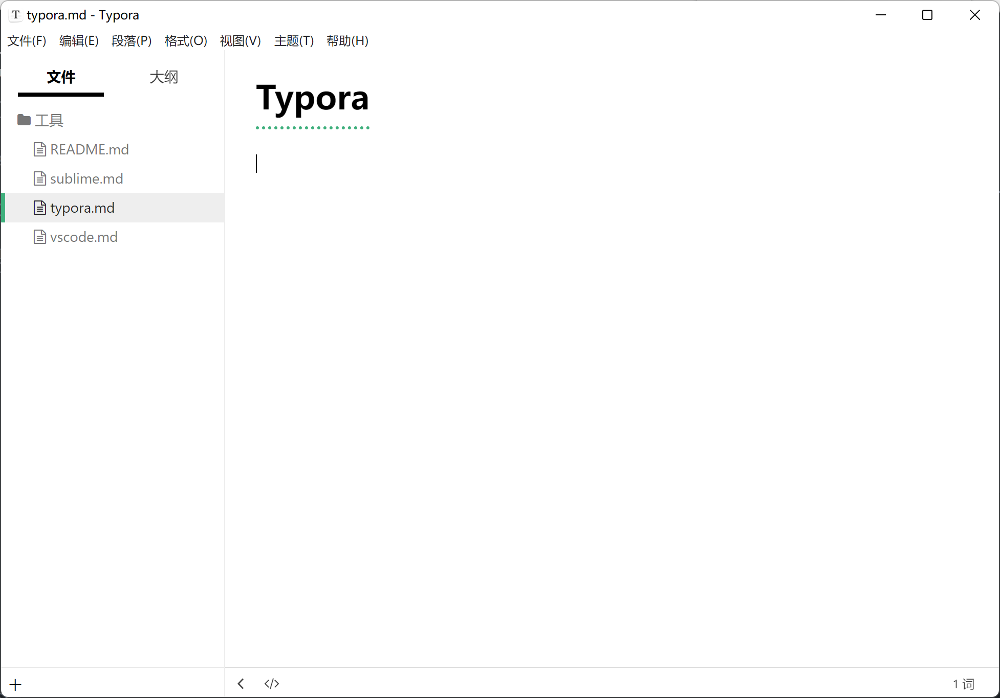
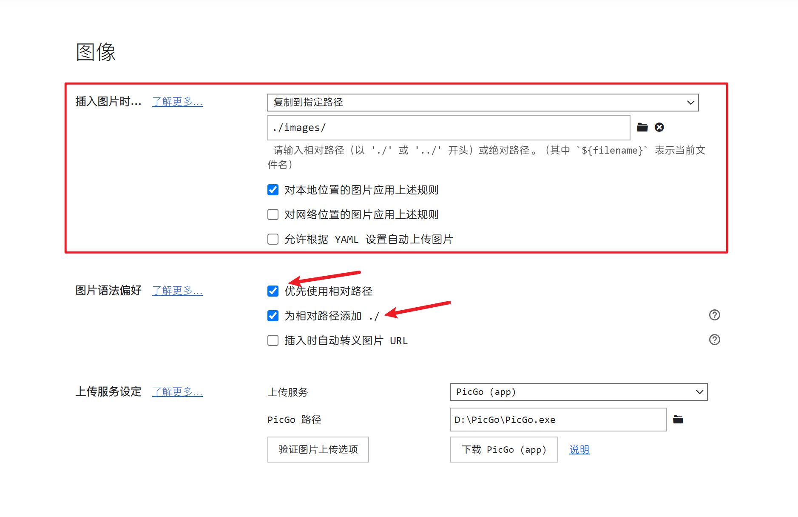

预览图：



官网：[https://typora.io/](https://typora.io/)

## **核心配置**

### **主题**：

**drake-google**

### **设置快捷键**：

快捷键官网：[Shortcut Keys - Typora Support](https://support.typora.io/Shortcut-Keys/)


点击软件界面左上角的 `文件` > `偏好设置...` > `通用` > `打开高级设置`

打开 `conf.user.json` 这个文件，将下面的配置添加到其中

```JSON
"keyBinding": {
  "Code Fences": "Ctrl+E", // 代码块
  "Code": "Alt+C", // 行内代码
},
```

## 其他

最后一个免费版本是 `0.11.18`

下载地址：[https://www.aliyundrive.com/s/v5tERQHBkPr](https://www.aliyundrive.com/s/v5tERQHBkPr)

## 配置图片选项

