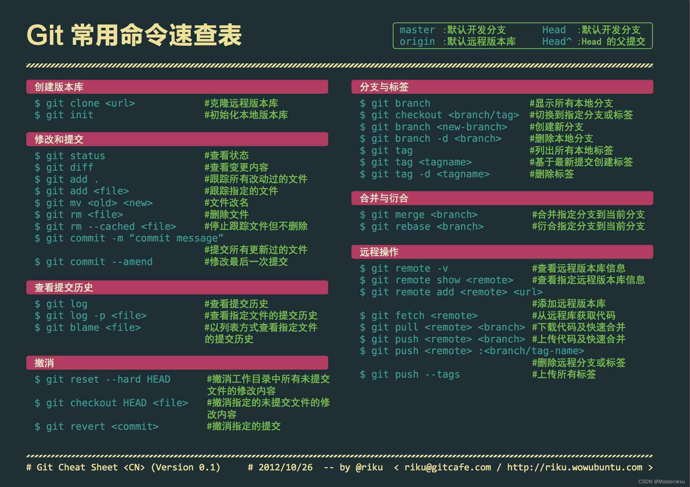
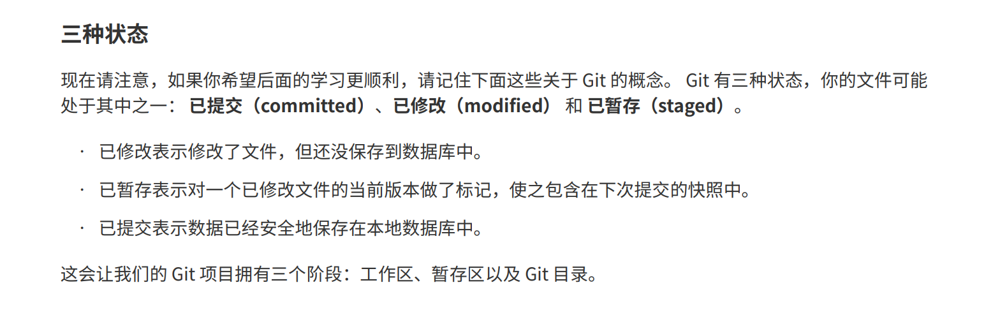
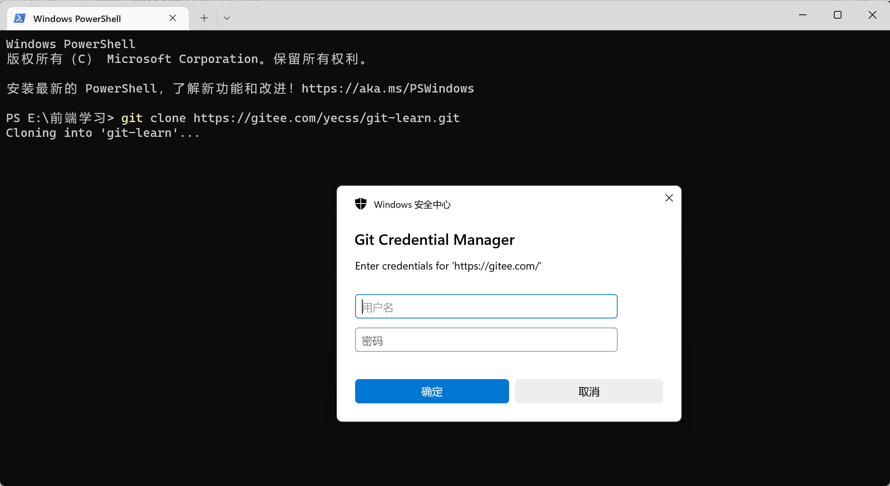
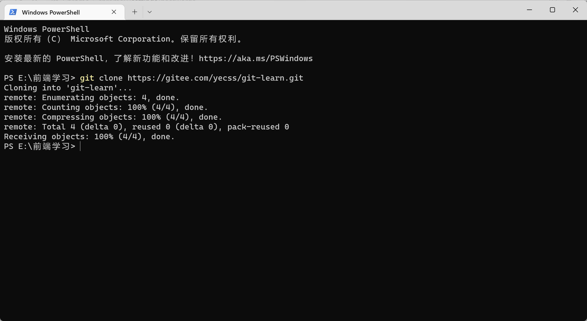
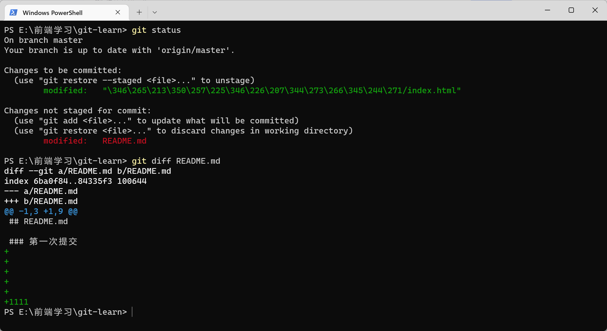
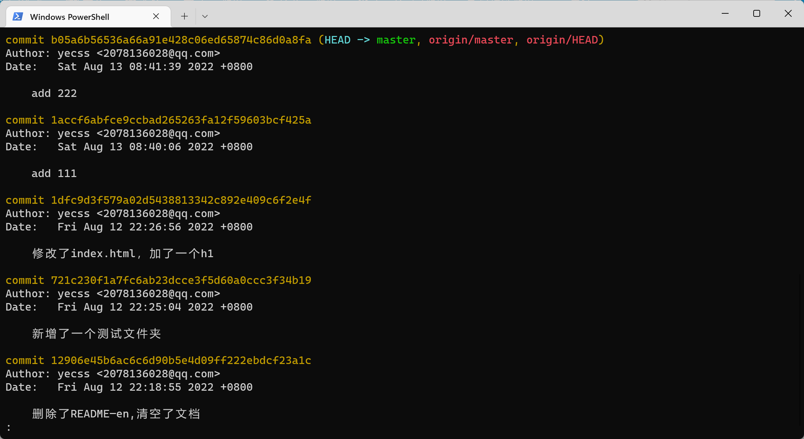
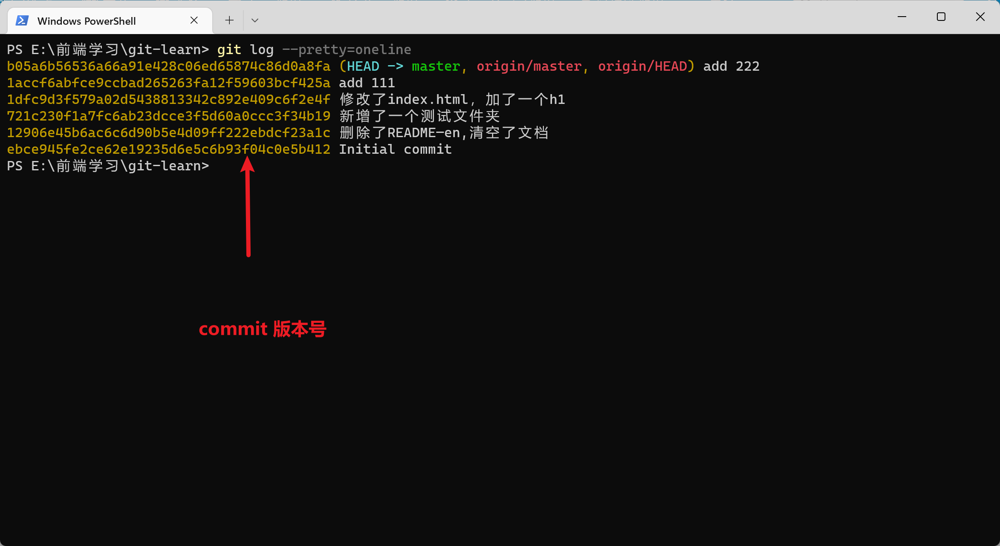
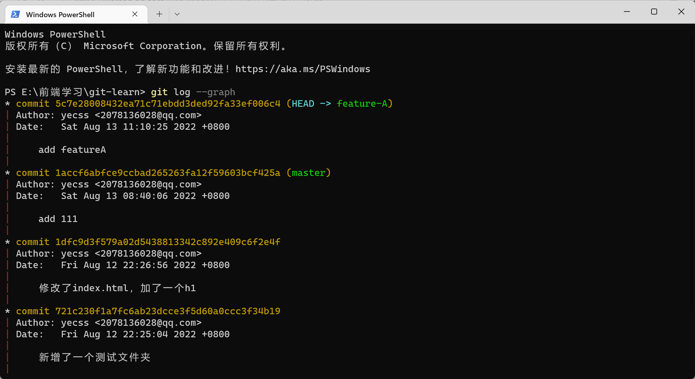
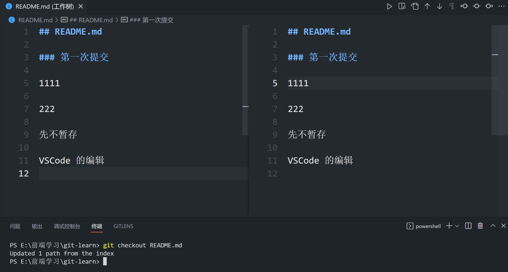
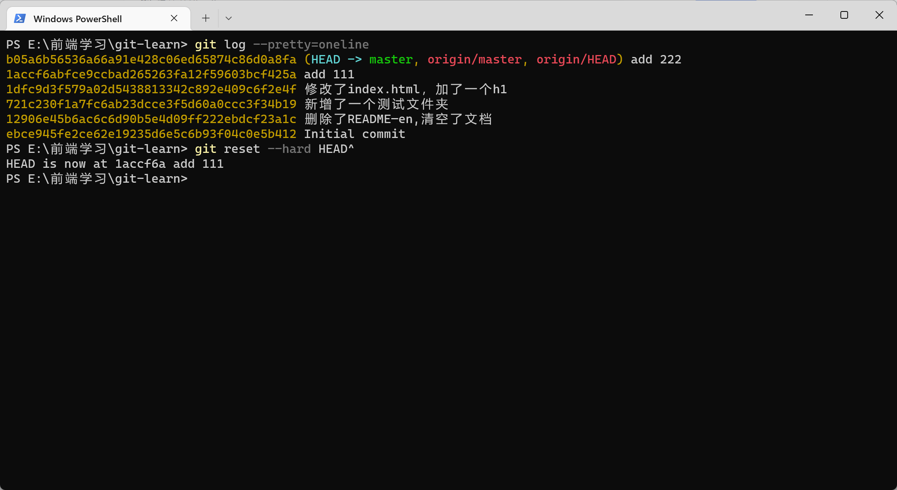

# Git

## 状态

状态解释图


此文档基于 Gitee，用来学习 Git 的一些列操作。

## 速查表



## Git的三种状态



- Repository - 仓库

- Branch - 分支

- Commit - 提交

## 克隆项目

```bash
git clone https://gitee.com/yecss/git-learn.git
```

接着需要输入密码，



输入完成之后，可以看到，已经克隆成功。



## 状态简览

```Bash
git status

git status -s
# 简单的查看
```


## 暂存文件

```Bash
git add .
git add *
git add 文件名
```

## 推送文件

```Bash
git push origin master

# origin -- 远程仓库的别名
# master -- 推送到 master 分支
```

## 查看文件的修改

先修改文件，但是先不暂存，然后运行 `git diff`



```Bash
git diff 文件名
# git diff README.md
```

## 查看历史记录





```Bash
git log

# 简洁版 git log --pretty=oneline
# 图表形式查看分支 git log --graph
```



小技巧！

使用字母 q 退出处于输入状态下的 git log

## 文件回滚

已经修改但是还没有暂存（stage）的文件可以使用以下命令回滚到之前的文件

```Bash
git checkout <filename>
```



对于已经提交（commited）的文件可以使用以下方式回滚。

首先，Git必须知道当前版本是哪个版本，在Git中，用`HEAD`表示当前版本，也就是最新的提交`1094adb...`（注意我的提交ID和你的肯定不一样），上一个版本就是`HEAD^`，上上一个版本就是`HEAD^^`，当然往上100个版本写100个`^`比较容易数不过来，所以写成`HEAD~100`。

```Bash
git reset --hard HEAD^
```



Git rest 的参数

- --hard：不保存所有变更

- --soft：保留变更且变更内容处于Staged

- --mixed：保留变更且变更内容处于Modified


## 分支操作

- `git branch` - 查看所有分支

- `git branch -D 分支名` - 删除分支  

```Bash
git branch feature-A
# 创建分支

git checkout feature-A
# 切换分支

git checkout -
# 切换回上一个分支

# 快速 git checkout -b feature-A
# git checkout -b a 在当前分支的基础上新建一个 a 分支
```

### 合并分支

在 master 分支下，合并 b 分支提交的内容

首先进入 master 分支

然后执行以下操作

```Bash
git merge b
```

## 忽略文件

```Bash
.gitignore
```

## Git与Github 远程仓库

`git pull` - 从远程拉取更改

`git push` - 推送到远程

当远程仓库的版本号高于本地仓库时，需要我们先pull 再去 push

(这个pull 的过程其实就是本地仓库和远程仓库合并的过程，而这个过程也有可能产生冲突。

## 设置代理

有时候配置了V2ray但是推送和拉取还总是超时，原来是没走代理，得需要手动配置如下：

### 1.http || https协议

```bash
//设置全局代理
//http
git config --global https.proxy http://127.0.0.1:1080
//https
git config --global https.proxy https://127.0.0.1:1080
//使用socks5代理的 例如ss，ssr 1080是windows下ss的默认代理端口,mac下不同，或者有自定义的，根据自己的改
git config --global http.proxy socks5://127.0.0.1:1080
git config --global https.proxy socks5://127.0.0.1:1080

//只对github.com使用代理，其他仓库不走代理
git config --global http.https://github.com.proxy socks5://127.0.0.1:10808
git config --global https.https://github.com.proxy socks5://127.0.0.1:10808
//取消github代理
git config --global --unset http.https://github.com.proxy
git config --global --unset https.https://github.com.proxy

//取消全局代理
git config --global --unset http.proxy
git config --global --unset https.proxy

```

### 2.SSH 协议

```csharp
//对于使用git@协议的，可以配置socks5代理
//在~/.ssh/config 文件后面添加几行，没有可以新建一个
//socks5
Host github.com
User git
ProxyCommand connect -S 127.0.0.1:1080 %h %p

//http || https
Host github.com
User git
ProxyCommand connect -H 127.0.0.1:1080 %h %p
```

参考文章：

[Git设置代理_马全鑫的博客-CSDN博客_git 设置代理](

## 查看git 的全局配置

```Bash
git config --global -l
```