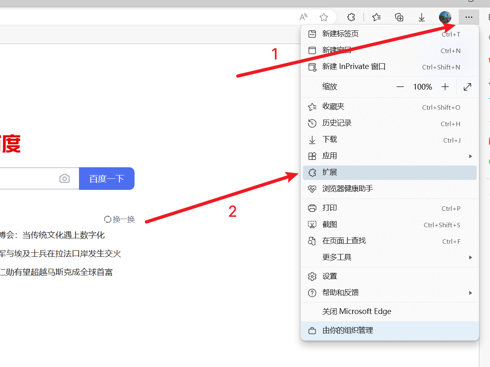
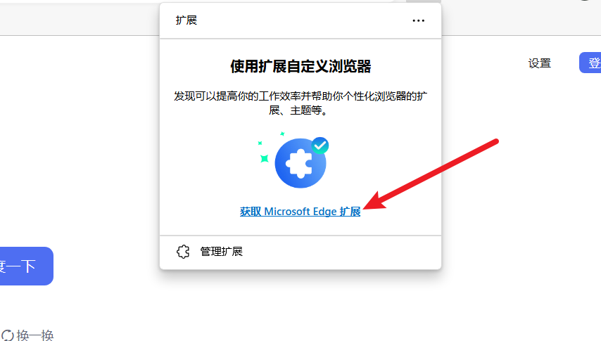
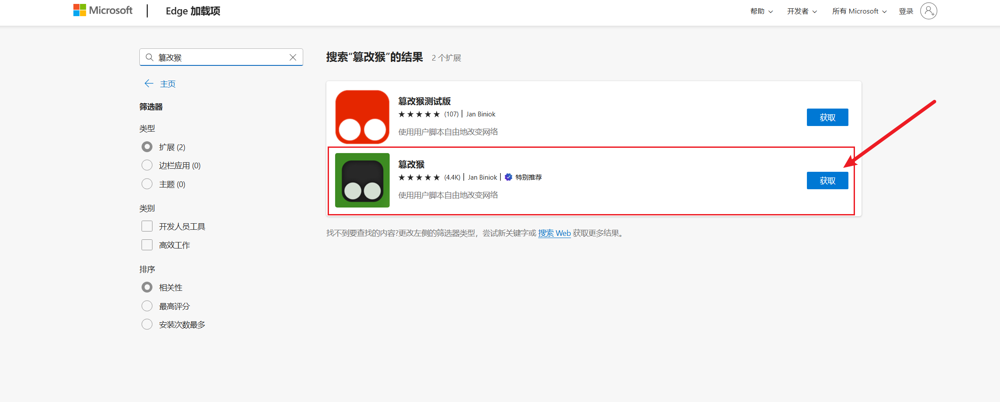
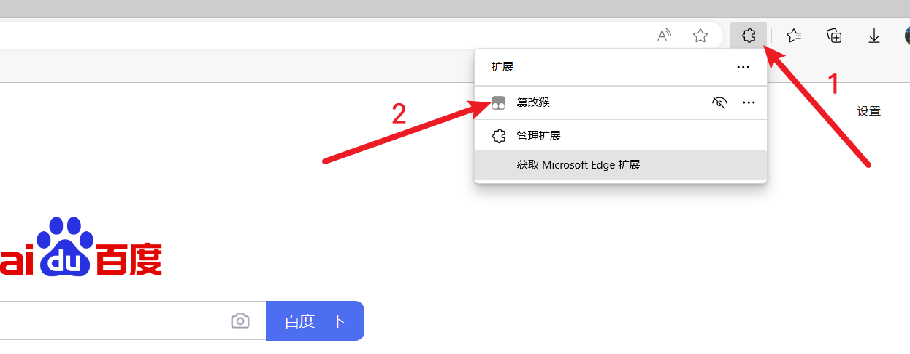
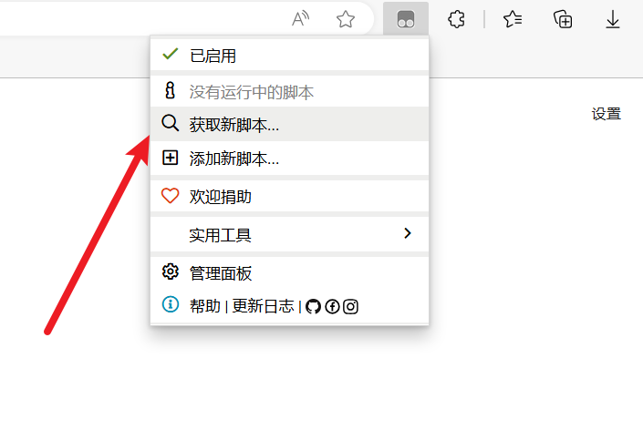

## 油猴插件介绍

官方介绍：

> **篡改猴 (Tampermonkey)** 是拥有 **超过 1000 万用户** 的最流行的浏览器扩展之一。 它适用于 [**Chrome**](https://www.tampermonkey.net/index.php?browser=chrome&ext=iikm&version=5.1.1)、[**Microsoft Edge**](https://www.tampermonkey.net/index.php?browser=edge&ext=iikm&version=5.1.1)、[**Safari**](https://www.tampermonkey.net/index.php?browser=safari&ext=iikm&version=5.1.1)、[**Opera Next**](https://www.tampermonkey.net/index.php?browser=opera&ext=iikm&version=5.1.1) 和 [**Firefox**](https://www.tampermonkey.net/index.php?browser=firefox&ext=iikm&version=5.1.1)。
>
> 有些人也会把篡改猴(Tampermonkey)称作油猴(Greasemonkey)，尽管后者只是一款仅适用于 Firefox 浏览器的浏览器扩展程序。
>
> 它允许用户自定义并**增强您最喜爱的网页的功能**。用户脚本是小型 JavaScript 程序，可用于向网页添加新功能或修改现有功能。使用 篡改猴，您可以轻松在任何网站上创建、管理和运行这些用户脚本。

网址：https://www.tampermonkey.net/index.php?ext=iikm&version=5.1.1

## 如何安装油猴插件

以Microsoft Edge浏览器为例，以下是安装油猴插件的步骤：

- 打开Edge浏览器。
- 进入浏览器扩展商店。
- 点击“获取浏览器扩展”。
- 在搜索框中输入“篡改猴”，然后找到并安装该插件。

**注意**：安装完成后，您会看到一个空的扩展图标，这意味着插件已安装但尚未启用。接下来，我们需要进一步操作来激活其功能。

然后搜索篡改猴，安装插件

注意，现在安装好的插件只是一个空壳，并没有什么实际作用，我们需要通过下面的操作，才能真正发挥他的威力。

## 获取并安装油猴脚本

1. 在已经安装好的浏览器插件列表中，找到篡改猴这个插件
2. 点击获取新脚本，就可以安装其他的各种各样的油猴脚本了。

在这里，我们可以搜索**关键字**来获取各种各样的脚本。

例如：

- **CSDN免登录复制**：允许您在不登录的情况下复制CSDN网站上的内容。
- **知乎免登录查看**：无需登录即可查看知乎的某些内容。
- **广告过滤**：自动过滤网页上的广告，提升浏览体验。
- **各种网页小工具**：提供各种便利的网页增强工具。
- **学习通xxx**：针对学习通平台的特定功能增强。

