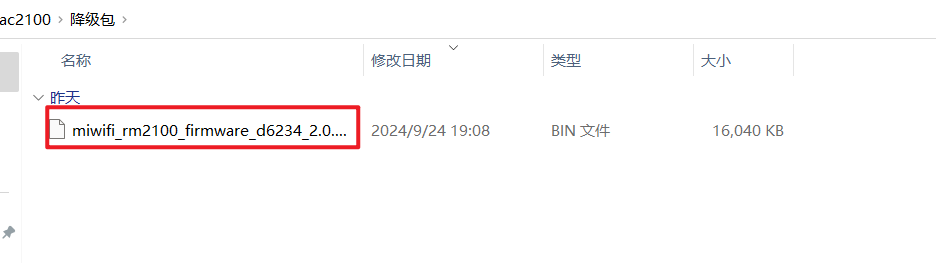
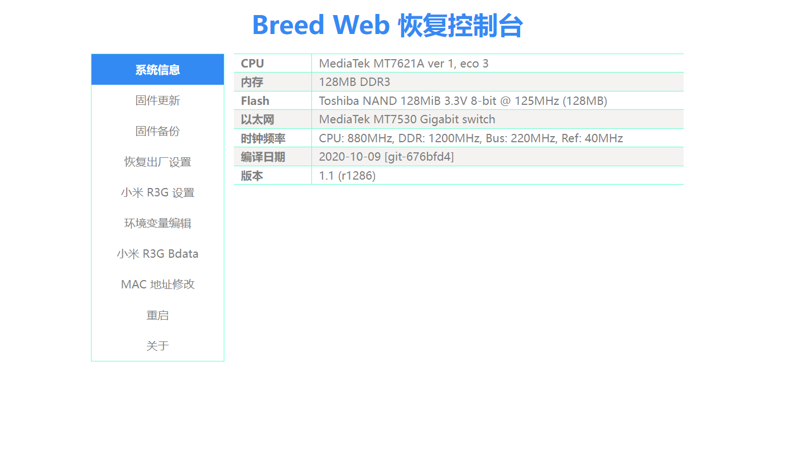
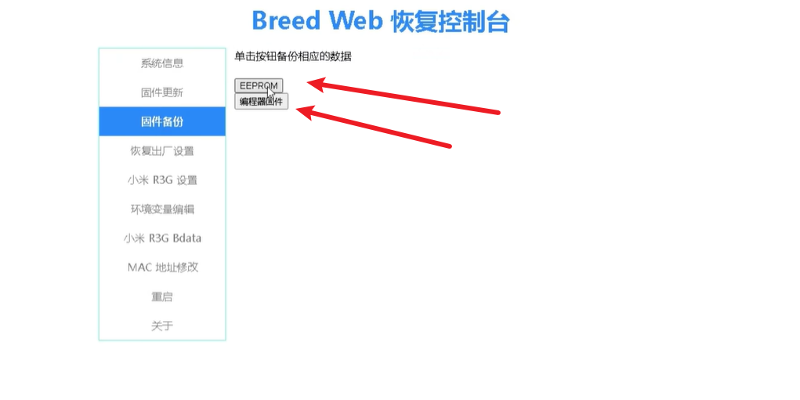
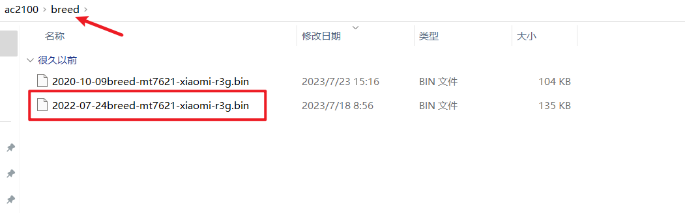
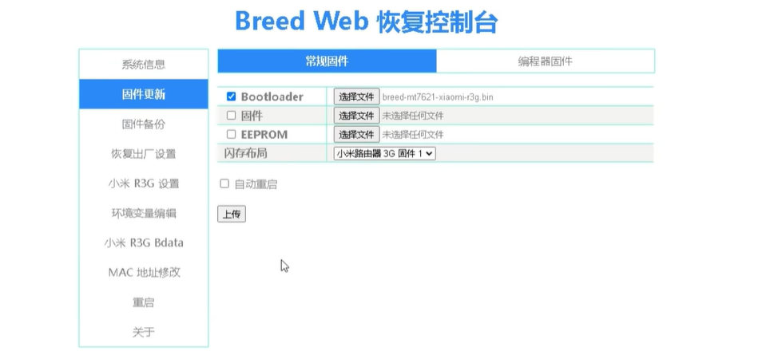
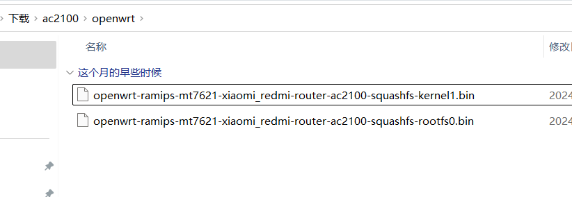
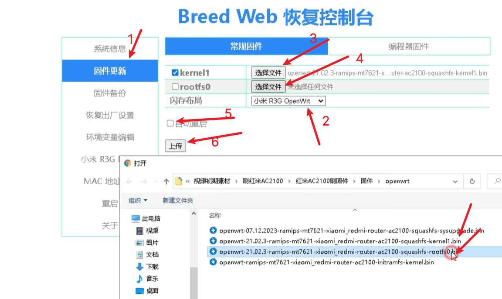
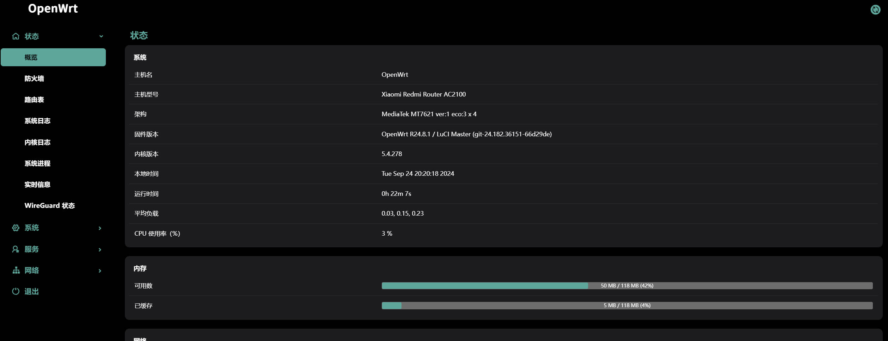

## 刷入Breed

参考教程：

- https://www.right.com.cn/forum/forum.php?mod=viewthread&tid=4066963&highlight=%CB%A2breed
- https://www.bilibili.com/video/BV1114y1X7TA/?vd_source=4866b7cfde4a08de2ba06a6ef4c96869

固件以及资源下载：https://yecss.lanzoul.com/i1N0H2aup7te

### 正文：

1.事前准备：

**确保路由器能上网**。两根网线。一根卡针/牙签也可以。

浏览器最好使用**无痕模式**，以防出现别的问题。

#### 固件先降级：

确保官方系统降级到2.0.7的版本

降级包所在目录：



浏览器输 192.168.31.1 进入后台→常用设置→系统状态→手动升级→加载固件(可以保留数据)→开始升级

#### 刷写breed：

降级成功之后再次进入后台，在地址栏获取stok。

复制修改好stok的代码，粘贴到浏览器地址栏，然后**回车**。

若浏览器显示”{"code":0}“，则说明成功。

------

**这是检查坏块**

```
http://192.168.31.1/cgi-bin/luci/;stok=把复制的stok粘贴到这里/api/misystem/set_config_iotdev?bssid=Xiaomi&user_id=longdike&ssid=%0A%5B%20-z%20%22%24(dmesg%20%7C%20grep%20ESMT)%22%20%5D%20%26%26%20B%3D%22Toshiba%22%20%7C%7C%20B%3D%22ESMT%22%0Auci%20set%20wireless.%24(uci%20show%20wireless%20%7C%20awk%20-F%20'.'%20'%2Fwl1%2F%20%7Bprint%20%242%7D').ssid%3D%22%24B%20%24(dmesg%20%7C%20awk%20'%2FBad%2F%20%7Bprint%20%245%7D')%22%0A%2Fetc%2Finit.d%2Fnetwork%20restart%0A
```

**这是刷breed**

```
http://192.168.31.1/cgi-bin/luci/;stok=把复制的stok粘贴到这里/api/misystem/set_config_iotdev?bssid=Xiaomi&user_id=longdike&ssid=%0Acd%20%2Ftmp%0Acurl%20-o%20B%20-O%20https%3A%2F%2Fbreed.hackpascal.net%2Fr1286%2520%255b2020-10-09%255d%2Fbreed-mt7621-xiaomi-r3g.bin%20-k%20-g%0A%5B%20-z%20%22%24(sha256sum%20B%20%7C%20grep%20242d42eb5f5aaa67ddc9c1baf1acdf58d289e3f792adfdd77b589b9dc71eff85)%22%20%5D%20%7C%7C%20mtd%20-r%20write%20B%20Bootloader%0A
```

**如果路由器在60秒内重启则代表刷BREED成功**(灯会从**蓝**变**橘**，最终变**蓝**进入系统)。

成功之后拔掉电源，然后按住reset（电源口旁边的小孔）的同时插上电源，按住四五秒之后如果**system**指示灯是**蓝色闪烁**说明进入breed，然后打开浏览器的无痕模式（不同浏览器说法可能不一样），输入”192.168.1.1“即可进入breed后台。

### 一些小问题及解决方案。

#### 1.进入后台，结果显示"access barred"

用白名单设备进入后台，关闭”管理后台访问控制“

#### 2.breed界面显示：请求页面不存在


清除页面缓存或者直接用**无痕窗口**登录breed后台。

## 进入Breed

正常系统下，使用网线一端连接路由器Lan口，另一端连接电脑，进入路由器后台。

这个步骤的目的是测试路由器与电脑的连通性。

然后拔掉电源，按住reset，接上电源。

访问192.168.1.1，即可进入breed



首次访问breed，记住备份文件



## 更新Breed

刷入breed目录里面的 `2022-07-24breed-mt7621-xiaomi-r3g.bin` 新版breed





手动重启，重新进入breed

## 刷入openwrt固件





## 进入openwrt

浏览器输入：http://192.168.1.1/cgi-bin/luci/

账号：root

默认密码：password

