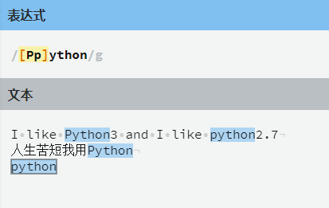
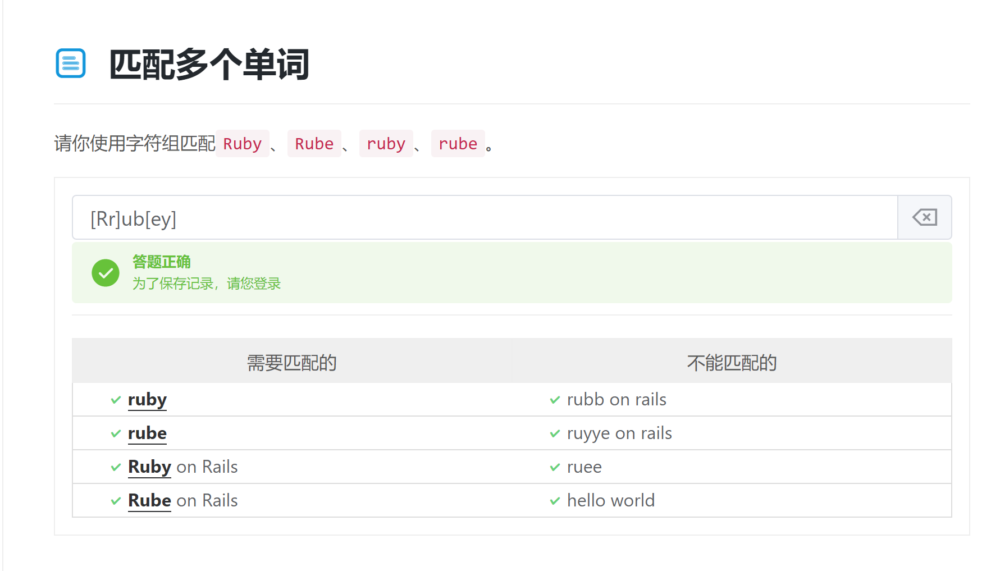
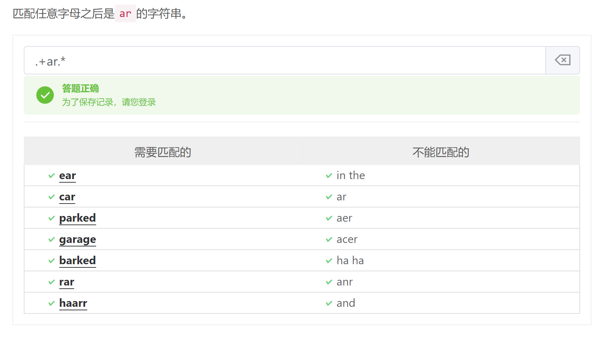
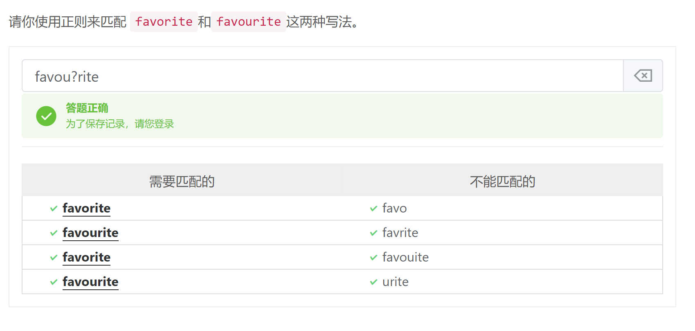
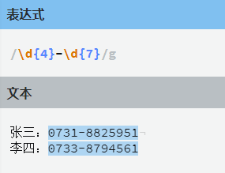
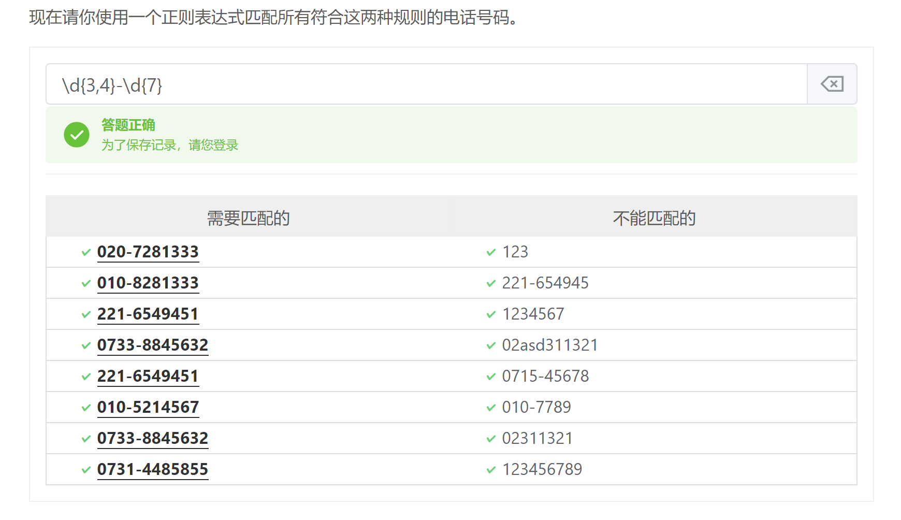
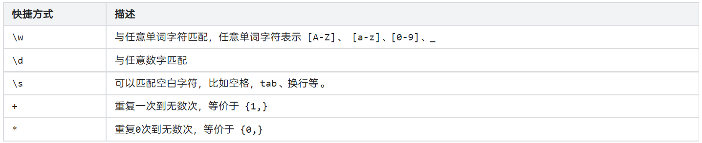

### 参考网站

https://any86.github.io/any-rule/

https://ihateregex.io/

[正则表达式参考文档 - Regular Expression Syntax Reference (regexlab.com)](http://www.regexlab.com/zh/regref.htm)

### 字符组

[Aa]   匹配A和a



匹配多个单词



### 区间

正则表达式引擎在字符组中使用连字符`(-)`代表区间，依照这个规则，我们可以总结出三点：

1. 要匹配任意数字可以使用`[0-9]`；

1. 如果想要匹配所有小写字母，可以写成`[a-z]`；

1. 想要匹配所有大写字母可以写成`[A-Z]`。

### 匹配特殊字符

使用反斜杠 `\` 来转义。如匹配 - 使用 `\-`

### 取反

可以通过在字符数组开头使用 `^` 字符实现取反操作，从而可以反转一个字符组（意味着会匹配任何指定字符之外的所有字符）。

### 开始和结束

正则表达式中 `^`指定的是一个字符串的开始，`$`指定的是一个字符串的结束。

例如

```
^python
python$
```

### 任意字符

`.`字符代表匹配任何单个字符，它只能出现在方括号以外。

值得注意的是： `.`字符只有一个不能匹配的字符，也就是换行符（`\n`），不过要让`.`字符与换行符匹配也是可以的，以后会讨论。



### 

### 可选字符

有时，我们可能想要匹配一个单词的不同写法，比如`color`和`colour`，或者`honor`与`honour`。

这个时候我们可以使用 `?` 符号指定一个字符、字符组或其他基本单元可选，这意味着正则表达式引擎将会期望该字符出现零次或一次。



### 重复

如果遇到这样的情况，我们可能期望一个字符组连续匹配好几次。

在一个字符组后加上`{N}` 就可以表示在它之前的字符组出现`N`次。



### 重复区间

```
{起始,结束}
{开始,} - 表示从开始到无限
```



### 快捷匹配


